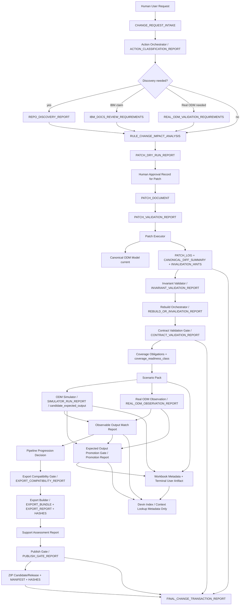

# ODM V7 — Documentação Unificada para Plano Geral de Implementação

**Status:** `FINAL_IMPLEMENTATION_PLANNING_READY / VALIDATED_BY_PHASE_5_PASS_WITH_WARNINGS / DOCUMENTAL_ONLY / SEM_CODIGO / SEM_MODIFICACAO_DOC_PRIMARIA / READY_FOR_IMPLEMENTATION_PLANNING_HANDOFF`  
**Data:** 2026-06-16  
**Fase de origem:** Fases 0–6 — Unificação documental completa, com validação crítica e pacote final  
**Uso pretendido:** base única de leitura para planejar a implementação da convergência entre Interação Usuário↔Devin, Canonical Patch, Coverage/Testes, Simulator-first, Real ODM Observation, Observable Match, Promotion, Workbook terminal, Export/Publish/ZIP e handoff para Devin.  
**Uso proibido:** usar este documento como prova de implementação, alterar documentação-guia primária sem redline/patch documental futuro, declarar repo paths/classes/comandos não descobertos, declarar claims IBM ODM/BRE sem evidência, tratar match como equivalência comportamental plena, tratar Workbook/Devin Index como fonte de regra ou prova de publish.

> Esta documentação final é uma síntese reescrita. Ela não é concatenação dos insumos. Ela preserva decisões, resolve duplicações, registra lacunas e foi validada na Fase 5 com status `PASS_WITH_WARNINGS`. Os warnings permanecem explícitos como guardrails, não como autorização para implementação ou claims fortes.


**Validação e empacotamento:** esta versão terminal incorpora as correções obrigatórias da Fase 5: status final validado, preservação de `NEEDS_DOC_PROPAGATION`, `NEEDS_REPO_DISCOVERY`, `NEEDS_IBM_DOCS`, `NEEDS_REAL_ODM_VALIDATION`, tratamento de P-004/P-005/P-006 como owner assertions/`DEVIN_REPO_KNOWN` para planejamento, e nota explícita sobre a divergência nominal do documento de promotion/state transitions.


## 0. Status, escopo e uso pretendido

**Origem principal:** `PHASE-0`, `PHASE-1`, `PHASE-2`, `PHASE-3`, `PRIMARY-ESSENCE`, `OWNER-COVERAGE`, `DERIVED-USER-DEVIN`.  
**Authority note:** esta seção define o estado documental final desta unificação. Ela não cria arquitetura nova fora dos insumos aprovados/validados, não modifica a documentação-guia e não executa implementação.

Esta documentação unificada existe para responder, em uma única narrativa rastreável, como a ODM Engineering Platform V7 deve tratar pedidos humanos de consulta/alteração de regras IBM ODM/BRE por meio do Devin, governando mudanças no `Canonical ODM Model`, reconstruindo/inválidando derivados, planejando coverage/testes, executando Simulador, observando IBM ODM Real, comparando observáveis, promovendo expected outputs quando permitido, produzindo Workbook terminal, avançando até export/ZIP com gates corretos e preservando todos os guardrails da plataforma.

| Dimensão | Status final | Interpretação |
|---|---|---|
| Documento | `FINAL_IMPLEMENTATION_PLANNING_READY / VALIDATED_BY_PHASE_5_PASS_WITH_WARNINGS` | Documentação terminal deste pacote, pronta para servir como base de plano de implementação, com warnings preservados. |
| Implementação | `NO_FUNCTIONAL_IMPLEMENTATION` | Nenhum código foi escrito ou autorizado por esta fase. |
| Documentação primária | `NO_PRIMARY_DOC_MUTATION` | A documentação-guia permanece inalterada. |
| Repo real | `NEEDS_REPO_DISCOVERY` | Este documento não afirma paths/classes/comandos reais. |
| IBM ODM Real | `NEEDS_REAL_ODM_VALIDATION` para claims comportamentais fortes | Ambiente/observação entram no plano, mas evidências concretas precisam ser anexadas/confirmadas. |
| IBM docs | `NEEDS_IBM_DOCS` para claims específicos | Claims IBM-specific seguem evidence-gated. |
| Workbook físico | `DEFERRED_NON_BLOCKING` | Layout físico não bloqueia o core pipeline P0. |
| Legacy migration | `OUT_OF_SCOPE` | Só reentra por comando explícito/ADR. |

### Uso permitido

- Base para plano de implementação incremental P0/P1/P2.
- Base para repo discovery delta, characterization e contract mapping.
- Base para redlines documentais futuras.
- Handoff controlado para Devin antes de implementação.
- Índice de conflitos resolvidos, gates, artifacts, statuses, blockers e Requirement→Evidence.

### Uso proibido

- Declarar que a documentação-guia já foi atualizada.
- Declarar implementação concluída.
- Declarar equivalência comportamental plena.
- Declarar importabilidade/publicação por `PASS_OBSERVABLE_MATCH`.
- Usar Workbook como source/evidence/export/publish proof.
- Usar Devin Index como autoridade.
- Inventar repo paths, classes, comandos, endpoints, payloads, schemas físicos ou detalhes IBM ODM.

**Requirement → Evidence local**

| ID | Requirement | Evidence | Status |
|---|---|---|---|
| R0.1 | Status e uso pretendido declarados | Cap. 0 | `ATENDIDO` |
| R0.2 | Uso proibido explicitado | Cap. 0 | `ATENDIDO` |
| R0.3 | Gaps principais preservados | `NEEDS_REPO_DISCOVERY`, `NEEDS_DOC_PROPAGATION`, `NEEDS_IBM_DOCS`, `NEEDS_REAL_ODM_VALIDATION` | `ATENDIDO_COM_GUARDRAIL` |


## 1. Autoridade documental e fontes

**Origem principal:** `PRIMARY-DECISIONS`, `PRIMARY-ESSENCE`, `PRIMARY-CONTRACTS`, `PRIMARY-IBM`, `PHASE-1`, `DERIVED-CONVERGENCE`.  
**Authority note:** a documentação-guia primária decide arquitetura; o pacote otimizado roteia; relatórios derivados aceleram análise; a proposta owner-approved decide a frente de Cobertura/Testes para planejamento, mas exige propagação documental futura.

### Hierarquia de autoridade aplicada

| Ordem | Fonte | Uso |
|---:|---|---|
| 1 | Decision Ledger ou ADR aprovado mais recente, se aplicável | Resolve decisões versionadas e conflitos explícitos. |
| 2 | `00_PROJECT_ESSENCE/` | Princípios, guardrails e anti-alucinação. |
| 3 | `20_ARCHITECTURE_CONTRACTS/` | Schemas, contracts, diagnostics, lifecycle, validation. |
| 4 | `30_IBM_ODM_KNOWLEDGE/` | Claims IBM ODM/BRE, Target Profile, support, semantics, export compatibility. |
| 5 | `10_ARCHITECTURE_OVERVIEW/` | Fontes de verdade, derivados, visão geral. |
| 6 | `40_DAG_AND_ROADMAP/` | DAG lógico, phase gates, dependências. |
| 7 | `60_IMPLEMENTABLE_ELEMENTS/` | Dossiês implementáveis por componente. |
| 8 | `50_ORCHESTRATORS/` | Coordenação operacional, não implementação interna. |
| 9 | `70_DEVIN_PLAYBOOKS/`, `80_PROMPT_LIBRARY/` | Execução derivada, não autoridade primária. |
| 10 | `45_LEGACY_MIGRATION_TO_TARGET/` | Apenas para escopo legacy explícito. |
| 11 | Repo real | Somente com repo discovery, path real, hash, comando ou evidência equivalente. |
| 12 | Reports, prompts, summaries, handoffs | Apoio/índice/evidência derivada; não fonte decisória primária. |

### Classificação dos insumos desta unificação

| Alias | Tipo | Autoridade |
|---|---|---|
| `ZIP_FULL_POS_CLEANUP.zip` | primary | Fonte arquitetural primária da documentação-guia ODM V7. |
| `ODM_CHATGPT_OPTIMIZED_SUPPORT_PACK.zip` | support/derived | Roteamento e recuperação eficiente; não decide arquitetura. |
| `CONSOLIDADO_INTERACAO_USUARIO_DEVIN...md` | derived input | Consolida frente Usuário↔Devin; deve ser confrontado com primária. |
| `ODM_V7_ARQUITETURA_COBERTURA_TESTES_FINAL_OWNER_APPROVED...md` | owner-approved | Base aprovada pelo owner para planejamento da frente Cobertura/Testes; requer `NEEDS_DOC_PROPAGATION`. |
| `ODM_V7_CONVERGENCIA...zip` | derived convergence package | Síntese, ledgers, matrices e handoff; não substitui documentação-guia. |
| `00/01/02/03_*` | phase working artifacts | Evidência de unificação e rastreabilidade local. |

### Regra de tensão documental

Quando houver tensão entre a documentação-guia primária e a proposta owner-approved, a documentação final deve registrar o conflito como `NEEDS_DOC_PROPAGATION`, `NEEDS_OWNER_REVIEW`, `NEEDS_ADR_UPDATE` ou `SUPERSEDED_BY_APPROVED_OWNER_DECISION`, sem “corrigir” silenciosamente o baseline primário.

**Requirement → Evidence local**

| ID | Requirement | Evidence | Status |
|---|---|---|---|
| R1.1 | Autoridade documental aplicada | Tabelas de hierarquia e classificação | `ATENDIDO` |
| R1.2 | Derivados reclassificados como apoio | Seção 1 | `ATENDIDO` |
| R1.3 | Tensão owner-approved vs primária preservada | Labels de propagação/review | `ATENDIDO_COM_GUARDRAIL` |


## 2. Invariantes e guardrails não negociáveis

**Origem principal:** `PRIMARY-ESSENCE`, `PRIMARY-SOURCES`, `PRIMARY-CONTRACTS`, `OWNER-COVERAGE`, `DERIVED-USER-DEVIN`, `PHASE-2`.  
**Authority note:** estes guardrails são condições de segurança da arquitetura. Qualquer exceção exige decisão/ADR explícito e evidência compatível.

| Guardrail | Regra | Risco evitado | Gate/controle associado |
|---|---|---|---|
| Fonte editável | `Canonical ODM Model` é a fonte única editável corrente das regras. | Corrupção por edição de derivado. | Patch Protocol, Patch Executor, Invariant Validation. |
| Derivados | MEO, Structural AST, DLM, Type System, Scenario Pack, Workbook, Export Bundle e Devin Index são derivados/views, salvo decisão primária explícita. | Fonte paralela e stale artifacts. | Rebuild/Invalidation, Contract Validation. |
| Patch | Mudanças em regra passam por Patch Protocol e Patch Executor. | Mudança informal e não auditável. | Patch Validation, Patch Log, Canonical Diff. |
| Invariants | Canonical pós-patch precisa passar por Invariant Validation. | Estado canônico inválido. | Invariant Validation Report. |
| Simulador | Simulador produz `candidate_expected_output`, nunca truth. | Oráculo interno falso. | Simulator Run Report, Promotion Gate. |
| Promotion | Candidate só vira verified via Promotion Gate. | Auto-promotion indevida. | Expected Output Promotion Report. |
| Observable match | `PASS_OBSERVABLE_MATCH` é sinal de progressão até export, não equivalência plena, importability ou publish. | Overclaim comportamental/release indevido. | Observable Match, Pipeline Progression, Export Compatibility, Publish Gate. |
| Workbook | Workbook é `terminal_user_artifact`; `workbook_content` é forbidden source. | Retroalimentação da planilha como regra/evidência. | Metadata allowlist/denylist, Contract Validation. |
| Devin Index | Devin Index/Context Lookup é metadata/evidence lookup, não autoridade. | Authority creep do agente. | Retrieval policy, forbidden sources. |
| Export vs publish | Export Builder é separado de Publish Gate. | Release sem readiness. | Export Compatibility, Support Assessment, Publish Gate. |
| XOM/BOM/JAR | Se existirem, são artifacts técnicos derivados/sync ou dependências runtime, não fontes paralelas. | Multi-repo drift e fonte divergente. | I/O Impact, XOM_BOM_JAR Impact, repo discovery. |
| Repo claims | Claims de repo exigem discovery com evidência. | Paths/comandos inventados. | Repo Discovery Delta, Characterization. |
| IBM claims | Claims IBM ODM/BRE exigem IBM docs, Real ODM execution, SME review, teste, relatório ou blocker. | Alucinação IBM-specific. | IBM docs review, Real ODM Observation, SME evidence. |

### Proibições explícitas

- Não declarar equivalência comportamental plena por output igual.
- Não inferir trace interno, agenda, firing, ruleflow ou path interno do IBM ODM Real.
- Não tratar `PASS_OBSERVABLE_MATCH` como Promotion Gate.
- Não tratar `PASS_OBSERVABLE_MATCH` como Publish Gate.
- Não tratar Workbook/HTML/report humano como source/gate/evidence autônoma.
- Não indexar conteúdo de Workbook no Devin Index.
- Não aplicar patch stale ou sem `precondition_hash`.
- Não sincronizar XOM/BOM/JAR sem `NEEDS_REPO_DISCOVERY` resolvido.

**Requirement → Evidence local**

| ID | Requirement | Evidence | Status |
|---|---|---|---|
| R2.1 | Guardrails centrais preservados | Tabela Guardrail/Regra/Risco/Gate | `ATENDIDO` |
| R2.2 | Boundaries sensíveis explicitados | Proibições explícitas | `ATENDIDO` |
| R2.3 | Claims IBM/repo bloqueados sem evidência | `NEEDS_IBM_DOCS`, `NEEDS_REAL_ODM_VALIDATION`, `NEEDS_REPO_DISCOVERY` | `ATENDIDO_COM_GUARDRAIL` |


## 3. Tese arquitetural consolidada

**Origem principal:** `PRIMARY-DAG`, `PRIMARY-ORCH`, `PRIMARY-ELEMENTS`, `OWNER-COVERAGE`, `DERIVED-USER-DEVIN`, `DERIVED-CONVERGENCE`.  
**Authority note:** a tese consolida arquitetura de planejamento. Ela não declara módulos físicos do repo nem implementação concluída.

A arquitetura convergida da ODM V7 deve operar como uma transação governada ponta a ponta. O usuário expressa uma intenção de mudança; Devin entrevista, normaliza, classifica e governa a rota; mudanças editáveis entram por `Patch Protocol` e são aplicadas no `Canonical ODM Model`; derivados são reconstruídos ou invalidados; contratos bloqueiam contaminação de fontes e claims; coverage/testes geram obligations e cenários; o Simulador produz candidatos; o IBM ODM Real, quando disponível e validado no escopo, fornece observações externas de output/status/errors; o Harness compara observáveis; o resultado de match pode liberar progressão até export; Promotion decide verified outputs; Workbook e reports entregam visão humana terminal; Export/Publish/ZIP seguem gates próprios.

A tese corrigida é:

```text
Usuário pede
→ Devin entrevista e classifica
→ patch governado altera Canonical
→ invariants/derived lifecycle/contracts validam a mudança
→ coverage obligations e Scenario Pack definem o espaço de teste
→ Simulator gera candidate_expected_output
→ Real ODM Observation coleta output/status/errors observáveis
→ Observable Match compara facetas observáveis
→ Pipeline Progression pode avançar até export quando PASS + prerequisites
→ Promotion Gate decide verified_expected_output localmente
→ Workbook/report são terminais humanos
→ Export Builder gera candidate/bundle/report
→ Support Assessment + Publish Gate decidem release
→ ZIP exige manifest/hashes/reports e status rastreável
```

### Anti-overengineering aplicado

A documentação final evita criar uma camada nova para cada substantivo. Camadas aqui são responsabilidades lógicas, não módulos físicos presumidos. Representative Scenario Generation é capability interna do Scenario Pack; Context Router formal fica `DEFERRED`; Workbook físico é `DEFERRED_NON_BLOCKING`; Behavioral Knowledge persistence fica P1/P2.

**Requirement → Evidence local**

| ID | Requirement | Evidence | Status |
|---|---|---|---|
| R3.1 | Tese unificada expressa | Fluxo consolidado | `ATENDIDO` |
| R3.2 | Sem overclaim de implementação | Authority note e labels | `ATENDIDO_COM_GUARDRAIL` |
| R3.3 | Anti-overengineering aplicado | Nota de camadas lógicas | `ATENDIDO` |


## 4. Glossário canônico unificado

**Origem principal:** `PRIMARY-DECISIONS`, `PRIMARY-CONTRACTS`, `OWNER-COVERAGE`, `PHASE-2`.  
**Authority note:** os termos abaixo devem ser usados de forma consistente na documentação e no plano de implementação. Termos obsoletos não devem reaparecer sem nota de supersession.

| Termo | Definição final | Confusão proibida |
|---|---|---|
| `Canonical ODM Model` | Fonte única editável corrente das regras. | MEO/DLM/Workbook/Export como fonte de regra. |
| `patch_document` | Artifact formal que descreve mudança proposta no Canonical. | Edição manual direta de JSON/derivado. |
| `precondition_hash` | Hash/condição que previne patch stale. | Aplicar patch em base desconhecida. |
| `Patch Executor` | Executor que aplica patch validado ao Canonical. | Validar release ou comportamento IBM. |
| `Invariant Validator` | Validador do estado canônico pós-patch. | Provar importability/publish. |
| `Canonical Change Transaction` | Spine de rastreabilidade ponta a ponta do pedido até ZIP/release status. | Gate substituto. |
| `Coverage Criteria Profile` | Policy-only que define critérios de cobertura. | Fonte editável de regra. |
| `Coverage Obligation Model` | Artifact persistido de obligations exigidas/classificadas. | Report humano opcional. |
| `Type Domain Projection` | Derived view do Type System para representative domains. | `Type Domain Profile` como fonte/policy independente. |
| `coverage_readiness_class` | Classificação agregada da prontidão de cobertura. | Status genérico `ready/partial`. |
| `Scenario Pack` | Artifact de definição de cenários, inputs, hashes, refs e bindings. | Truth store de resultados. |
| `candidate_expected_output` | Output candidato produzido pelo Simulador. | Output verificado/verdade. |
| `verified_expected_output` | Output promovido por Promotion Gate com evidence e scope. | Candidate ou match automático. |
| `Real ODM Observation` | Observação externa de output/status/errors do IBM ODM Real. | Inferência de internals. |
| `PASS_OBSERVABLE_MATCH` | Match observável local de output/status/errors no escopo. | Equivalência plena, importability ou publish readiness. |
| `pipeline_progression_signal_until_export_generation` | Sinal de progressão até export generation/attempt, condicionado a pré-requisitos. | Release/publish automático. |
| `Promotion Gate` | Gate auditável que promove expected output por scenario/facet/field/scope. | Human approval ou Observable Match. |
| `Workbook terminal` | Entregável humano derivado e terminal. | Fonte de regra/evidência/export proof. |
| `Devin Index` | Lookup de metadados/evidence refs. | Autoridade decisória. |
| `Export Bundle` | Artifact de export gerado por Export Builder. | ZIP publicado/release final. |
| `Publish Gate` | Gate de readiness/release/publicação. | Export report ou match positivo. |
| `XOM/BOM/JAR impact` | Avaliação de artifacts técnicos derivados/sync/runtime. | Fonte paralela de regra. |

**Requirement → Evidence local**

| ID | Requirement | Evidence | Status |
|---|---|---|---|
| R4.1 | Termos normalizados | Glossário | `ATENDIDO` |
| R4.2 | Termos obsoletos reclassificados | `Type Domain Projection`, `pipeline_progression_signal_until_export_generation` | `ATENDIDO_OWNER_APPROVED_NEEDS_DOC_PROPAGATION` |


## 5. Macroarquitetura convergida

**Origem principal:** `PRIMARY-DAG`, `PRIMARY-ORCH`, `PRIMARY-ELEMENTS`, `OWNER-COVERAGE`, `DERIVED-CONVERGENCE`.  
**Authority note:** as macrocamadas são responsabilidades lógicas alvo. O mapping físico para repo real é `NEEDS_REPO_DISCOVERY`.

| Macrocamada | Responsabilidade | Producers | Consumers | Gates/boundaries |
|---|---|---|---|---|
| Human Intake & Action Governance | Capturar intenção, classificar ação, bloquear ambiguidade. | User, Devin, Action Orchestrator | Patch/Discovery/Investigation routes | Intake completeness, Action Classification. |
| Rule Source & Canonical Governance | Manter regra editável no Canonical e aplicar patches. | Patch Protocol, Patch Executor | Rebuild, Validation, Coverage | Patch Validation, Invariant Validation. |
| Derived Lifecycle | Reconstruir, preservar, invalidar ou bloquear artifacts derivados. | Rebuild Orchestrator | Contract Validation, downstream builders | Lifecycle/Invalidação/Staleness. |
| Contract Validation | Validar schemas, envelopes, lineage, source/evidence refs e claims. | Contract Validation Gate | Coverage, Match, Promotion, Export, Publish | Negative tests e forbidden claims. |
| Coverage Planning | Gerar obligations e readiness para profile escolhido. | Coverage Criteria/Profile, DLM/Type projections | Scenario Pack | Coverage status/readiness. |
| Scenario Definition | Definir cenários representativos e negativos, sem resultados mutáveis. | ScenarioPackBuilder | Simulator, Real ODM, Workbook metadata | Scenario Pack validation. |
| Internal Execution | Produzir candidate outputs, diagnostics e support scope. | ODM Simulator | Match, Promotion, Workbook metadata | Candidate-only boundary. |
| External Observation | Observar IBM ODM Real via outputs/status/errors observáveis. | Real ODM Connector | Match, Promotion | IBM/Real evidence policies. |
| Comparison & Progression | Comparar observáveis e decidir progressão operacional. | Equivalence Harness/Observable Match | Export Progression, Promotion evidence | No full equivalence/publish/importability. |
| Promotion | Promover expected outputs por evidence, facet e scope. | Promotion Gate | Workbook metadata, Index, downstream validation | Evidence precedence/expiry. |
| Human Delivery | Entregar Workbook/reports humanos terminais. | Workbook generator/report builders | Human User | Metadata-only ingress; content forbidden. |
| Knowledge Access | Indexar metadados/evidence refs, freshness, lineage. | Devin Index/Context Lookup | Devin retrieval | No authority; no workbook content. |
| Export/Publish/Release | Gerar export candidate, avaliar support, aprovar publish, empacotar ZIP. | Export Builder, Support Assessment, Publish Gate | User/Release process | Export Compatibility, Publish Gate, manifest/hashes. |

### Anti-responsabilidades

- Rule Source não conhece Workbook, Publish ou Devin Index como fonte.
- Coverage não armazena run results como truth.
- Simulator não promove expected output.
- Match não publica, não importa, não prova comportamento interno.
- Workbook e reports humanos não retroalimentam o pipeline como source.
- Devin Index não decide claims sensíveis.

**Requirement → Evidence local**

| ID | Requirement | Evidence | Status |
|---|---|---|---|
| R5.1 | Macrocamadas convergidas definidas | Tabela de macrocamadas | `ATENDIDO` |
| R5.2 | Boundaries por camada explícitos | Anti-responsabilidades | `ATENDIDO` |
| R5.3 | Mapping físico bloqueado sem repo | `NEEDS_REPO_DISCOVERY` | `ATENDIDO_COM_GUARDRAIL` |


## 6. DAG integrado Usuário → Patch → Coverage/Testes → Export → ZIP

**Origem principal:** `PRIMARY-DAG`, `PRIMARY-ORCH`, `DERIVED-USER-DEVIN`, `DERIVED-CONVERGENCE`, `OWNER-COVERAGE`.  
**Authority note:** o DAG abaixo é lógico; não é claim de módulos/classes reais. O mapping físico deve vir em repo discovery/contract mapping.



### Leitura obrigatória

1. `Human Approval Record` aprova checkpoints humanos, como aplicar patch, mas não substitui Promotion Gate, Publish Gate, IBM docs ou Real ODM evidence.
2. `PASS_OBSERVABLE_MATCH` alimenta `Pipeline Progression Decision`; não é auto-promotion.
3. `Export Builder` gera candidate/bundle/report; `Publish Gate` governa readiness/release.
4. Workbook e reports humanos são derivados/terminais; apenas metadados permitidos podem entrar no Index.
5. O `FINAL_CHANGE_TRANSACTION_REPORT` fecha rastreabilidade; não substitui gates.

| Etapa | Artifact mínimo | Gate/stop condition |
|---|---|---|
| Intake | `CHANGE_REQUEST_INTAKE` | `STOP_NEEDS_USER_CLARIFICATION` se ambíguo. |
| Classification | `ACTION_CLASSIFICATION_REPORT` | `UNKNOWN_NEEDS_INVESTIGATION` se rota não segura. |
| Discovery | `REPO_DISCOVERY_REPORT`, `IBM_DOCS_REVIEW_REQUIREMENTS`, `REAL_ODM_VALIDATION_REQUIREMENTS` | `BLOCKED_NEEDS_*` quando exigido. |
| Patch | `PATCH_DOCUMENT`, `PATCH_VALIDATION_REPORT`, `PATCH_LOG` | patch stale/incompleto bloqueia. |
| Invariant/Rebuild/Contract | validation/rebuild/contract reports | canonical inválido, stale artifact ou forbidden source bloqueia. |
| Coverage/Testes | coverage report, Scenario Pack, sim/real/match/promotion reports | unknown obligations e Real ODM errors limitam claims. |
| Export/Publish/ZIP | export compatibility, export report, support, publish, manifest/hashes | publish separado de match/export. |

**Requirement → Evidence local**

| ID | Requirement | Evidence | Status |
|---|---|---|---|
| R6.1 | DAG ponta a ponta definido | Mermaid e tabela de etapas | `ATENDIDO` |
| R6.2 | Gates preservados | Leitura obrigatória | `ATENDIDO` |
| R6.3 | DAG lógico, não físico | Authority note | `ATENDIDO_COM_GUARDRAIL` |


## 7. Interação Usuário ↔ Devin e Playbook operacional alvo

**Origem principal:** `PRIMARY-ORCH`, `PRIMARY-ELEMENTS`, `DERIVED-USER-DEVIN`, `DERIVED-CONVERGENCE`.  
**Authority note:** este playbook é alvo de planejamento. Canais Devin reais, arquivos `.devin`, AGENTS, REVIEW, wiki, SKILL ou playbooks físicos só podem ser declarados após repo discovery.

### Papéis do Devin

| Papel | Deve fazer | Não deve fazer |
|---|---|---|
| Interlocutor | Entrevistar, capturar intenção, exemplos, comportamento atual/desejado, dúvidas. | Assumir intenção ambígua. |
| Classificador | Produzir `ACTION_CLASSIFICATION_REPORT` com route, gates e blockers. | Escolher route insegura por inferência. |
| Operador de patch | Gerar patch, validar, pedir aprovação, acionar executor, registrar logs/diff. | Editar JSON/derivados diretamente como fonte. |
| Operador de lifecycle/validation | Acionar rebuild/invalidation e Contract Validation. | Usar artifacts stale. |
| Operador de artifacts derivados | Gerar reports, Scenario Pack, simulator run, observation, match, promotion, workbook metadata, export reports. | Tratar esses artifacts como fonte primária. |
| Operador de código | Editar código apenas em tarefa técnica real, após repo discovery e validação. | Corrigir parser/export/sim/XOM sem paths/comandos/evidência. |
| Agente de governança | Bloquear quando houver lacuna, claim sensível, forbidden source ou gate falho. | Contornar bloqueio para “terminar o fluxo”. |

### Checkpoints humanos

| Checkpoint | Momento | Autoriza | Não autoriza |
|---|---|---|---|
| CP-1 | Após intake | Confirmar entendimento do pedido. | Alterar regra. |
| CP-2 | Após impact analysis | Confirmar risco/impacto. | Aplicar patch sem dry-run/validation. |
| CP-3 | Após patch dry-run | Aplicar patch no Canonical, se patch validado. | Promotion, publish ou IBM evidence. |
| CP-4 | Após canonical diff | Confirmar mudança aplicada. | Release automático. |
| CP-5 | Antes de export/publish | Revisar readiness e warnings. | Bypassar Export Compatibility/Publish Gate. |
| CP-6 | Antes de XOM/BOM/JAR sync | Autorizar investigação/sync se discovery permitir. | Sync multi-repo sem discovery. |
| CP-7 | Antes de ZIP_RELEASED | Aprovar liberação final quando policy exigir. | Declarar importability/equivalence sem evidência. |

### Stop conditions globais

- Pedido ambíguo: `STOP_NEEDS_USER_CLARIFICATION`.
- Target canonical não identificado: `BLOCKED_PATCH_TARGET_UNKNOWN`.
- Patch stale/precondition mismatch: `PATCH_BLOCKED`.
- Repo discovery necessário ausente: `BLOCKED_NEEDS_REPO_DISCOVERY`.
- IBM docs necessárias ausentes: `BLOCKED_NEEDS_IBM_DOCS`.
- Real ODM validation necessária ausente: `BLOCKED_NEEDS_REAL_ODM_VALIDATION`.
- Workbook como source/evidence: `BLOCKED_WORKBOOK_CONTENT_FORBIDDEN_SOURCE`.
- Candidate promoted sem gate: `BLOCKED_AUTO_PROMOTION_FORBIDDEN`.
- Contract/Export/Publish Gate falho: `TRANSACTION_*_BLOCKED`.

**Requirement → Evidence local**

| ID | Requirement | Evidence | Status |
|---|---|---|---|
| R7.1 | Interação usuário↔Devin governada | Papéis e checkpoints | `ATENDIDO` |
| R7.2 | Aprovação humana separada de gates técnicos | Tabela CP | `ATENDIDO` |
| R7.3 | Canais reais não inventados | Authority note | `NEEDS_REPO_DISCOVERY` |


## 8. Action taxonomy e roteamento

**Origem principal:** `PRIMARY-ORCH`, `PRIMARY-ELEMENTS/075`, `DERIVED-USER-DEVIN`, `DERIVED-CONVERGENCE/reports/07`.  
**Authority note:** a taxonomia orienta rotas autorizadas; rotas físicas dependem de repo discovery.

| Action type | Rota autorizada | Evidence/context requerido | Gates | Stop condition |
|---|---|---|---|---|
| `RULE_LOGIC_CHANGE` | Patch Protocol → Canonical → Rebuild/Validation | target canonical, business intent, examples | Patch, Invariant, Contract | `BLOCKED_PATCH_TARGET_UNKNOWN` |
| `THRESHOLD_CHANGE` | Patch Protocol → Canonical | rule/threshold target, current/desired behavior | Patch, Invariant, Contract | `PATCH_BLOCKED` |
| `OUTPUT_ASSIGNMENT_CHANGE` | Patch + I/O Impact | output field/class, examples, expected behavior | Patch, Contract, Coverage/Promotion if applicable | `BLOCKED_CONTRACT_VALIDATION` |
| `INPUT_FIELD_CHANGE` | Patch + I/O Contract + XOM/BOM/JAR assessment | field semantics/type/source, runtime impact | Contract, Export, XOM/BOM impact | `UNKNOWN_NEEDS_REPO_DISCOVERY` |
| `OUTPUT_FIELD_CHANGE` | Patch + I/O Contract + Export assessment | output schema/consumer impact | Contract, Export Compatibility, Publish boundary | `BLOCKED_EXPORT_PREREQUISITE` |
| `TYPE_CHANGE` | Canonical/Type System impact + Patch | type domain, validations, affected scenarios | Invariant, Contract, Coverage | `NEEDS_REVIEW` if semantics unclear |
| `STRUCTURAL_MODEL_CHANGE` | Investigation/Repo Discovery → plan | model/storage/builders | Repo discovery, contract mapping | `BLOCKED_NEEDS_REPO_DISCOVERY` |
| `BAL_PARSING_RELATED_CHANGE` | Repo discovery → parser/builder implementation plan | paths, tests, parser behavior | Build/test gates | `BLOCKED_NEEDS_REPO_DISCOVERY` |
| `SIMULATOR_BEHAVIOR_CHANGE` | Simulator dossier + tests + candidate-only | support scope, diagnostics, examples | Contract Validation, negative tests | `NEEDS_REAL_ODM_VALIDATION` for behavior claims |
| `TEST_GENERATION_CHANGE` | Coverage/Scenario contracts | obligations, scenarios, fixtures | Scenario Pack validation | `BLOCKED_REQUIRED_OBLIGATIONS` |
| `WORKBOOK_RENDERING_CHANGE` | Workbook terminal metadata/rendering | format decision if needed | Metadata allowlist/denylist | `DEFERRED_NON_BLOCKING` if physical detail absent |
| `EXPORT_PACKAGE_CHANGE` | Export Compatibility + Export Builder + Publish Gate | target profile, support matrix, package evidence | Export, Support, Publish | `NEEDS_IBM_DOCS`/`NEEDS_REAL_ODM_VALIDATION` if IBM-specific |
| `XOM_BOM_JAR_IMPACT` | I/O Impact + repo discovery + sync policy | external repo/runtime dependency evidence | XOM/BOM/JAR impact, rollback | `UNKNOWN_NEEDS_REPO_DISCOVERY` |
| `UNKNOWN_NEEDS_INVESTIGATION` | Investigation only | clarify intent/evidence | none until classified | `STOP_NEEDS_USER_CLARIFICATION` |

**Forbidden route:** `User request → Devin edits JSON/derived artifact → ZIP`.

**Requirement → Evidence local**

| ID | Requirement | Evidence | Status |
|---|---|---|---|
| R8.1 | Ações classificáveis | Action routing matrix | `ATENDIDO` |
| R8.2 | Rotas proibidas bloqueadas | Forbidden route | `ATENDIDO` |
| R8.3 | Rotas físicas evidence-gated | `NEEDS_REPO_DISCOVERY` | `ATENDIDO_COM_GUARDRAIL` |


## 9. Canonical Change Transaction

**Origem principal:** `PRIMARY-CONTRACTS`, `PRIMARY-ORCH`, `DERIVED-USER-DEVIN`, `DERIVED-CONVERGENCE/reports/06`.  
**Authority note:** a transação é target spec/backlog de rastreabilidade. A documentação final não afirma que o artifact já existe no repo. Status: `NEEDS_DOC_PROPAGATION / NEEDS_REPO_DISCOVERY`.

A `Canonical Change Transaction` é a espinha dorsal que conecta pedido humano, patch, rebuild, coverage/testes, export/publish/ZIP e evidências. Ela deve ser tratada como artifact de rastreabilidade, não como gate substituto.

### Campos mínimos do `FINAL_CHANGE_TRANSACTION_REPORT`

| Campo | Obrigatório | Observação |
|---|---:|---|
| `transaction_id` | sim | Identidade estável da transação. |
| `user_request_ref` | sim | Referência ao pedido humano original. |
| `change_request_ref` | sim | Ref para `CHANGE_REQUEST_INTAKE`. |
| `action_classification_ref` | sim | Ref para classificação/route/gates. |
| `discovery_refs` | quando aplicável | Repo/IBM/Real ODM requirements/reports. |
| `impact_analysis_ref` | sim | Impacto em canonical/derived/coverage/export/XOM etc. |
| `patch_dry_run_ref` | P0 recomendado/target | Diff previsto, risks, invalidation hints. |
| `approval_records` | quando aplicável | Checkpoints humanos, sem substituir gates técnicos. |
| `patch_document_ref` | se patch | Patch formal. |
| `patch_log_ref` | se patch aplicado | Log/audit. |
| `canonical_before_hash` / `canonical_after_hash` | se patch | Pre/post state. |
| `canonical_diff_summary_ref` | se patch | Resumo auditável. |
| `invariant_validation_ref` | se patch | Estado canônico validado. |
| `rebuild_report_ref` | se derivados | Rebuild/invalidation/preserve/block/defer. |
| `contract_validation_report_ref` | sim para consumo downstream | Schemas, lineage, forbidden claims. |
| `scenario_pack_ref` | quando aplicável | Cenários/inputs/refs. |
| `simulation_report_refs` | quando aplicável | Candidate outputs. |
| `real_odm_observation_refs` | quando aplicável/disponível | Outputs/status/errors observáveis. |
| `observable_match_refs` | quando aplicável | Match local. |
| `promotion_report_refs` | quando promotion | Verified outputs scoped. |
| `workbook_metadata_refs` | quando workbook | Metadata only. |
| `xom_bom_jar_impact_ref` | quando I/O impact | Status/gates. |
| `export_compatibility_ref` | para export | Prereqs/compatibility. |
| `export_report_ref` | para export | Bundle/report/hashes. |
| `support_assessment_ref` | para publish/release | Scope/limitations. |
| `publish_gate_report_ref` | para release | Readiness decision. |
| `zip_manifest_ref` / `zip_hash_ref` | para ZIP | Manifest/hashes. |
| `blocked_steps` | sempre | Lista de blockers e labels. |
| `final_status` | sempre | Namespace `transaction_status`. |

### Status finais da transação

```text
TRANSACTION_INTAKE_ONLY
TRANSACTION_PATCH_BLOCKED
TRANSACTION_PATCH_APPLIED
TRANSACTION_REBUILD_BLOCKED
TRANSACTION_CONTRACT_BLOCKED
TRANSACTION_EXPORT_BLOCKED
TRANSACTION_PUBLISH_BLOCKED
TRANSACTION_ZIP_RELEASED
TRANSACTION_FAILED
TRANSACTION_SUPERSEDED
```

**Requirement → Evidence local**

| ID | Requirement | Evidence | Status |
|---|---|---|---|
| R9.1 | Transação rastreável definida | Campos mínimos | `ATENDIDO` |
| R9.2 | Status finais definidos | transaction_status | `ATENDIDO` |
| R9.3 | Existência física não afirmada | Authority note | `NEEDS_REPO_DISCOVERY` |


## 10. Canonical Patch, Patch Executor e Invariant Validation

**Origem principal:** `PRIMARY-ELEMENTS/074-077`, `PRIMARY-CONTRACTS`, `DERIVED-USER-DEVIN`, `PHASE-2`.  
**Authority note:** esta seção define o alvo arquitetural de mudança governada. Implementação física no repo é `NEEDS_REPO_DISCOVERY`.

### Fluxo de patch governado

| Passo | Entrada | Saída | Failure mode |
|---|---|---|---|
| Patch intent | intake, action classification, impact analysis | candidate patch outline | `STOP_NEEDS_USER_CLARIFICATION` se ambíguo. |
| Patch dry-run | target refs, diff previsto, canonical hash | `PATCH_DRY_RUN_REPORT` | `PATCH_BLOCKED` se target/precondition não confiável. |
| Approval | dry-run + risk + blockers | `APPROVAL_RECORD` | Approval ausente bloqueia aplicação, mas não substitui gates. |
| Patch formal | approved change + preconditions | `PATCH_DOCUMENT` | Patch incompleto/stale bloqueia. |
| Patch validation | patch document + precondition hash | `PATCH_VALIDATION_REPORT` | `PATCH_BLOCKED`. |
| Execution | validated patch | Canonical pós-patch + `PATCH_LOG` | `FAILED_PATCH_REPORT`; canonical anterior permanece current. |
| Diff/invalidation hints | before/after hashes | `CANONICAL_DIFF_SUMMARY`, `INVALIDATION_HINTS` | Sem diff/hash, downstream fica bloqueado. |
| Invariant validation | canonical pós-patch + patch log | `INVARIANT_VALIDATION_REPORT` | `BLOCKED_INVALID_CANONICAL_STATE`. |

### Regras obrigatórias

- Patch não pode mirar Workbook, Scenario Pack, Export Bundle, Devin Index ou report derivado como fonte de regra.
- Patch stale ou sem `precondition_hash` não é aplicável.
- Patch aplicado não significa release pronto.
- Canonical pós-patch inválido bloqueia rebuild/consumo downstream.
- `FAILED_PATCH_REPORT` deve preservar que o canonical anterior permanece current.

**Requirement → Evidence local**

| ID | Requirement | Evidence | Status |
|---|---|---|---|
| R10.1 | Patch governado descrito | Fluxo de patch | `ATENDIDO` |
| R10.2 | Invariant Validation obrigatória | Regras obrigatórias | `ATENDIDO` |
| R10.3 | Implementação real não presumida | Authority note | `NEEDS_REPO_DISCOVERY` |


## 11. Rebuild, invalidation e lifecycle de artifacts

**Origem principal:** `PRIMARY-CONTRACTS/25`, `PRIMARY-ORCH/51`, `PRIMARY-DAG`, `DERIVED-USER-DEVIN`.  
**Authority note:** lifecycle evita stale artifacts e fonte derivada indevida. Mapping para builders reais é `NEEDS_REPO_DISCOVERY`.

Após mudança canônica, todo artifact derivado afetado deve ser classificado explicitamente:

```text
REBUILD
INVALIDATE
PRESERVE
BLOCK
DEFER
```

| Artifact | Ação esperada após patch | Consumer bloqueado se stale? | Observação |
|---|---|---:|---|
| MEO / Structural AST | `REBUILD` ou `INVALIDATE` | sim | Derivado estrutural, não fonte editável. |
| Source Registry / Symbol Table / Type System | `REBUILD`/`PRESERVE` com hash/lineage | sim | Depende do impacto. |
| DLM / Coverage View / Type Domain Projection | `REBUILD` | sim | Views derivadas. |
| Coverage Obligations | `REBUILD` se regra/profile afetado | sim | Não liberar readiness com obligations unknown. |
| Scenario Pack | `REBUILD`/`INVALIDATE` | sim | Não contém run results mutáveis. |
| Simulator Run Report | `INVALIDATE` se input/model changed | sim | Candidate ligado a input/canonical hash. |
| Real ODM Observation Report | `INVALIDATE` se input/model/profile changed | sim para match/promotion | Pode ser preserved só com equivalência de input/hash/scope evidenciada. |
| Observable Match Report | `INVALIDATE` se sim/real/canonical changed | sim | Não reutilizar match stale. |
| Promotion Report | `INVALIDATE`/`PRESERVE_WITH_SCOPE` | sim | Necessita scope, evidence, expiry. |
| Workbook metadata | `REBUILD`/`INVALIDATE` | não como source | Terminal; não alimenta regra. |
| Devin Index metadata | `REBUILD`/`INVALIDATE` refs | sim para lookup | Metadata-only. |
| Export artifacts | `INVALIDATE` se canonical/support/export prereqs mudarem | sim | Candidate export não vira release. |

### Report obrigatório

`REBUILD_OR_INVALIDATION_REPORT` deve listar artifact id, previous hash, current action, producer, consumer, source refs, invalidation reason, downstream blockers e recovery action.

**Requirement → Evidence local**

| ID | Requirement | Evidence | Status |
|---|---|---|---|
| R11.1 | Derivados tratados explicitamente | Matriz de lifecycle | `ATENDIDO` |
| R11.2 | Staleness bloqueado | Consumer bloqueado se stale | `ATENDIDO` |
| R11.3 | Builders reais não inventados | Authority note | `NEEDS_REPO_DISCOVERY` |


## 12. Coverage/Test Planning

**Origem principal:** `PRIMARY-CONTRACTS`, `PRIMARY-IBM/34`, `PRIMARY-ELEMENTS/082`, `OWNER-COVERAGE`, `DERIVED-CONVERGENCE`.  
**Authority note:** decisões owner-approved sobre Coverage/Testes entram como base de planejamento e exigem `NEEDS_DOC_PROPAGATION` para se tornarem baseline primário.

Coverage completa significa que todas as required obligations do coverage profile escolhido foram resolvidas com status explícito. `unknown` não libera readiness forte.

| Elemento | Classificação | Função |
|---|---|---|
| `Coverage Criteria Profile` | `POLICY_ONLY` | Define critérios requeridos/optional/waived por profile. |
| `DLM Coverage View` | `DERIVED_VIEW_ONLY` | View derivada do DLM para coverage. |
| `Type Domain Projection` | `DERIVED_VIEW_ONLY` | Projection do Type System para representative domains. |
| `Coverage Obligation Model` | `MUST_PERSIST` | Lista obligations e status por construct/facet/scenario need. |
| `coverage_readiness_class` | `REQUIRED_SUMMARY_CLASSIFICATION` | Agrega readiness por profile. |

### Status de coverage

```text
coverage_status = covered | partial | blocked | unsupported | infeasible | waived | unknown
```

### `coverage_readiness_class`

```text
READY_FULL_WITHIN_PROFILE
READY_WITH_UNSUPPORTED_EXCLUSIONS
READY_WITH_WAIVERS
READY_PARTIAL_WITH_WARNINGS
BLOCKED_UNKNOWN_OBLIGATIONS
BLOCKED_REQUIRED_OBLIGATIONS
INCONCLUSIVE
```

### Regras de planning

- Não reduzir antecipadamente o escopo para constructs simples se o owner declarou que constructs já cobertos devem ser mantidos como scope candidate.
- Não declarar suporte forte por construct/facet sem inventário/evidência.
- `unsupported`, `blocked`, `waived` e `unknown` devem aparecer no report e limitar claims.
- Obligations required sem status resolvido bloqueiam readiness forte.

**Requirement → Evidence local**

| ID | Requirement | Evidence | Status |
|---|---|---|---|
| R12.1 | Obligations planejadas por profile | Modelos/statuses | `ATENDIDO` |
| R12.2 | Readiness class definida | Lista `coverage_readiness_class` | `ATENDIDO_OWNER_APPROVED_NEEDS_DOC_PROPAGATION` |
| R12.3 | Constructs evidence-gated | Regras de planning | `NEEDS_REPO_DISCOVERY / NEEDS_IBM_DOCS` |


## 13. Scenario Pack e definição de cenários

**Origem principal:** `PRIMARY-ELEMENTS/082`, `PRIMARY-CONTRACTS`, `OWNER-COVERAGE`, `DERIVED-CONVERGENCE`.  
**Authority note:** Scenario Pack é artifact de definição. Ele não armazena resultados mutáveis como verdade.

### Campos mínimos do Scenario Pack

| Campo | Regra |
|---|---|
| `scenario_id` | Identidade estável. |
| `scenario_name` | Nome humano curto. |
| `coverage_obligation_refs` | Obligations cobertas/visadas. |
| `input_payload_ref` | Referência ao input, sem misturar result. |
| `input_hash` | Hash estável do input normalizado. |
| `binding_refs` | Bindings de fields/types/constructs. |
| `target_profile_ref` | Profile alvo. |
| `coverage_profile_ref` | Critério de coverage usado. |
| `source_refs` | Canonical/DLM/Type refs. |
| `expected_behavior_notes` | Notas de intenção, não expected verified. |
| `negative_case_marker` | Se é cenário negativo/edge/unsupported. |
| `lifecycle_status` | current/stale/invalidated etc. |

### Proibido no Scenario Pack

- `candidate_expected_output` inline como truth.
- `verified_expected_output` inline sem ref para Promotion Report.
- `real_odm_result` inline como result mutável.
- `match_status` inline como truth de cenário.
- Conteúdo extraído de Workbook.

Representative scenario generation é capability interna do Scenario Pack, não camada independente. Cenários devem ser representativos, rastreáveis, estáveis por hash e suficientes para obligations requeridas ou explicitamente marcados como blocked/unsupported/waived/unknown.

**Requirement → Evidence local**

| ID | Requirement | Evidence | Status |
|---|---|---|---|
| R13.1 | Scenario Pack como definition artifact | Campos mínimos | `ATENDIDO` |
| R13.2 | Truth-store proibido | Lista proibida | `ATENDIDO` |
| R13.3 | Gerador real não presumido | Authority note | `NEEDS_REPO_DISCOVERY` |


## 14. ODM Simulator e `candidate_expected_output`

**Origem principal:** `PRIMARY-ELEMENTS/084`, `PRIMARY-CONTRACTS/22`, `OWNER-COVERAGE`, `DERIVED-CONVERGENCE`.  
**Authority note:** o Simulador é engine operacional interna no support scope declarado; não é IBM ODM Real nem oráculo.

### `SIMULATOR_RUN_REPORT` mínimo

| Campo | Regra |
|---|---|
| `simulator_run_id` | Identidade estável. |
| `scenario_pack_ref` | Cenários executados. |
| `scenario_id` / `input_hash` | Correlação exata com input. |
| `canonical_ref` / `canonical_hash` | Base usada. |
| `target_profile_ref` | Escopo alvo. |
| `candidate_expected_output` | Output candidato, não truth. |
| `status` | run status namespaced. |
| `diagnostics` | warnings/errors/support limitations. |
| `support_scope` | Constructs/facets suportados/unsupported/blocked. |
| `confidence_local` | Local por scenario/construct/facet, se usado. |
| `limitations` | Limites explícitos. |
| `producer_version` | Builder/simulator version, se disponível. |

### Boundaries

- Candidate nunca vira verified sem Promotion Gate.
- Confidence não é global por default.
- Simulator Run Report não prova comportamento IBM ODM.
- Real ODM error não impede candidate generation, mas impede promotion positiva e match positivo.
- Unsupported/blocked diagnostics devem limitar coverage readiness e export/publish claims.

**Requirement → Evidence local**

| ID | Requirement | Evidence | Status |
|---|---|---|---|
| R14.1 | Candidate separado de verified | Boundaries | `ATENDIDO` |
| R14.2 | Diagnostics/support scope obrigatórios | Report mínimo | `ATENDIDO` |
| R14.3 | Claims fortes bloqueados sem Real ODM | Authority note | `NEEDS_REAL_ODM_VALIDATION` |


## 15. Real ODM Observation

**Origem principal:** `PRIMARY-IBM`, `PRIMARY-ELEMENTS/085`, `OWNER-COVERAGE`, `DERIVED-CONVERGENCE`.  
**Authority note:** IBM ODM Real permanece referência comportamental externa observável. Esta documentação final não inventa endpoint, auth, payload, ambiente ou mapping físico.

### Evidence mínima da observação

| Campo | Regra |
|---|---|
| `real_odm_observation_id` | Identidade estável. |
| `scenario_id` / `input_hash` | Correlação com Scenario Pack. |
| `target_profile_ref` | Escopo da observação. |
| `environment_fingerprint` | Identidade do ambiente, versionamento e limites. |
| `request_ref` / `response_ref` | Referências auditáveis, respeitando segurança. |
| `observed_output` | Output externo observável. |
| `observed_status` | Status externo observável. |
| `observed_errors` | Erros externos observáveis. |
| `timestamp` | Data/hora. |
| `limitations` | Lacunas de ambiente, timeout, retries, mapping. |
| `evidence_refs` | Logs/reports/tests permitidos. |

### Error policy

| Situação Real ODM | Efeito permitido | Efeito bloqueado |
|---|---|---|
| `OBSERVED` | Match, Promotion evidence, calibration local. | Inferir internals. |
| `OBSERVED_WITH_WARNINGS` | Match com warnings/limitations. | Claim forte sem limitações. |
| `ERROR_TRANSPORT` | Registrar diagnostic/handoff. | Verified expected positivo, PASS positivo, calibration positiva. |
| `ERROR_RUNTIME` | Registrar diagnostic e possível behavior issue. | Promotion positiva automática. |
| `INCONCLUSIVE` | Report/handoff. | `PASS_OBSERVABLE_MATCH`. |
| `NOT_AVAILABLE`/`NOT_RUN` | Candidate generation e planning continuam. | Verified by Real ODM, behavior claim forte. |

### Proibições IBM-specific

- Não inferir agenda, firing, salience, ruleflow, trace interno ou path de execução.
- Não inventar mapping de status/errors.
- Não usar output igual isolado como equivalência comportamental plena.
- Não declarar importability sem validação/import evidence adequada.

**Requirement → Evidence local**

| ID | Requirement | Evidence | Status |
|---|---|---|---|
| R15.1 | Observation externa definida | Evidence mínima | `ATENDIDO` |
| R15.2 | Internals não inferidos | Proibições IBM-specific | `ATENDIDO_COM_GUARDRAIL` |
| R15.3 | Detalhes físicos bloqueados | Authority note | `NEEDS_REPO_DISCOVERY / NEEDS_REAL_ODM_VALIDATION / NEEDS_IBM_DOCS` |


## 16. Observable Output Match e Pipeline Progression Decision

**Origem principal:** `PRIMARY-ELEMENTS/086`, `PRIMARY-CONTRACTS`, `OWNER-COVERAGE`, `DERIVED-CONVERGENCE`.  
**Authority note:** a decisão owner-approved permite progressão até export após `PASS_OBSERVABLE_MATCH`, mas com guardrails. Isso exige `NEEDS_DOC_PROPAGATION` para baseline primário.

### Regra central

```text
PASS_OBSERVABLE_MATCH = pipeline_progression_signal_until_export_generation
```

`PASS_OBSERVABLE_MATCH` pode satisfazer o pré-requisito comportamental observável para export progression, desde que as facetas requeridas no profile tenham passado e os demais pré-requisitos técnicos/contratuais também passem.

### Matriz de decisão

| `match_status` | Condição | `pipeline_progression_status` possível | Próximo passo permitido | Não permitido |
|---|---|---|---|---|
| `PASS_OBSERVABLE_MATCH` | outputs/status/errors observáveis batem no escopo requerido | `GO_TO_EXPORT` | Export Compatibility/Export Builder attempt se prereqs passarem. | Promotion automática, publish, importability proof, equivalência plena. |
| `PASS_OBSERVABLE_MATCH` com warnings | Match passa com exclusions/limitations não críticas | `GO_TO_EXPORT_WITH_WARNINGS` | Export attempt com warnings explícitos. | Claim forte sem limitações. |
| `FAIL_OBSERVABLE_MISMATCH` | Divergência observável | `INCONCLUSIVE_OBSERVABLE_MATCH` ou blocker | Investigation/calibration/bug report. | Export progression por match. |
| `BLOCKED_REAL_ODM` | Real ODM não observado ou erro bloqueante | `BLOCKED_REAL_ODM` | Candidate/handoff. | PASS positivo, Promotion by Real ODM. |
| `BLOCKED_CONTRACT_VALIDATION` | Schemas/lineage/source invalid | `BLOCKED_CONTRACT_VALIDATION` | Corrigir contracts. | Export/Promotion/Publish. |
| `NOT_RUN` | Match não executado | `INCONCLUSIVE_OBSERVABLE_MATCH` | Planning only. | Behavior/readiness claims. |

### Pré-requisitos não comportamentais para export progression

- Scenario Pack validado.
- Coverage obligations requeridas resolvidas ou classificadas.
- Target Profile presente.
- Construct Support Matrix compatível com o escopo.
- Artifact envelope/schema/version/lineage presentes.
- Contract Validation sem blockers críticos.
- Nenhuma contaminação por forbidden source.
- Export Builder preconditions satisfeitas.

**Requirement → Evidence local**

| ID | Requirement | Evidence | Status |
|---|---|---|---|
| R16.1 | Match delimitado | Matriz de decisão | `ATENDIDO_OWNER_APPROVED_NEEDS_DOC_PROPAGATION` |
| R16.2 | Export progression boundary definido | Pré-requisitos | `ATENDIDO_COM_GUARDRAIL` |
| R16.3 | Publish/importability/equivalence bloqueados por match isolado | Não permitido | `ATENDIDO` |


## 17. Expected Output Promotion Gate

**Origem principal:** `PRIMARY-CONTRACTS/24`, `OWNER-COVERAGE`, `DERIVED-CONVERGENCE`.  
**Authority note:** Promotion é decisão local, auditável e invalidável. Ela não é substituída por match ou aprovação humana.

### Regra central

```text
candidate_expected_output só vira verified_expected_output via Promotion Gate.
```

### Granularidade mínima

Promotion deve ser scoped por:

```text
scenario_id
input_hash
target_profile_ref
coverage_profile_ref
observable_facet
output_field_or_output_class
evidence_refs
limitations
policy_version
expiry_or_review_trigger
```

### Evidência admissível

| Evidence | Admissível? | Precedência | Limite |
|---|---:|---|---|
| Real ODM Observation | sim | Maior no mesmo escopo/profile/input | Não revela internals. |
| `PASS_OBSERVABLE_MATCH` | sim, como evidence input | Auxiliar ao Promotion Gate | Não promove automaticamente. |
| Curated fixture | sim, se metadados e validação | Inferior a Real ODM no mesmo escopo | Não sobrepõe conflito Real ODM sem ADR/waiver. |
| SME review | sim, se formal | Fallback/admissível | Requer reviewer/scope/limitations/expiry. |
| Simulator candidate | input para avaliação | Baixa/sem verification sozinho | Nunca verified por si só. |

### Status de promotion

```text
PROMOTION_NOT_REQUESTED
PROMOTION_BLOCKED
PROMOTION_INCONCLUSIVE
PROMOTION_REJECTED
PROMOTION_PARTIAL_VERIFIED
PROMOTION_VERIFIED_BY_REAL_ODM
PROMOTION_VERIFIED_BY_APPROVED_EVIDENCE
```

### Bloqueios obrigatórios

- Real ODM error ou inconclusive bloqueia promotion positiva por Real ODM.
- Evidence conflitante gera `PROMOTION_INCONCLUSIVE`, `PROMOTION_REJECTED` ou `PROMOTION_BLOCKED`.
- SME/fixture não sobrepõe Real ODM observado no mesmo escopo sem ADR/waiver explícito.
- Promotion global de cenário inteiro sem facet/field scope é proibida.

**Requirement → Evidence local**

| ID | Requirement | Evidence | Status |
|---|---|---|---|
| R17.1 | Promotion Gate explícito | Regra central/statuses | `ATENDIDO` |
| R17.2 | Evidence policy e precedência | Tabela de evidência | `ATENDIDO_OWNER_APPROVED_NEEDS_DOC_PROPAGATION` |
| R17.3 | SME workflow operacional pendente | Requirements de SME | `NEEDS_REVIEW` |


## 18. Workbook terminal e reports humanos

**Origem principal:** `PRIMARY-SOURCES`, `PRIMARY-CONTRACTS`, `OWNER-COVERAGE`, `DERIVED-USER-DEVIN`.  
**Authority note:** Workbook físico está `DEFERRED_NON_BLOCKING`. A boundary terminal é P0; layout XLSX/CSV/sheets/columns não bloqueia core pipeline.

### Classificação

| Artifact | Tipo | Pode alimentar downstream? | Observação |
|---|---|---:|---|
| Workbook | `terminal_user_artifact` | Não como source/evidence | Entregável humano derivado. |
| Workbook metadata | metadata allowlist | Sim, apenas refs/hash/status permitidos | Pode entrar no Devin Index. |
| HTML visualization/report | `derived_human_readable_report` | Não como gate/evidence autônoma | Apoio humano. |
| External user observation import | artifact novo e governado | Sim, se validado | Não é o Workbook retornando como source. |

### Metadata allowlist

Permitido:

```text
workbook_id
workbook_hash
generation_timestamp
scenario_pack_ref
mode
producer_version
source_refs
promotion_report_refs
file_name
artifact_status
```

Proibido:

```text
cell values
input rows
candidate outputs
verified outputs
real ODM results
manual user edits
business rule content extracted from workbook
raw
details
extra
content_summary
metadata_payload
payload
sheet_summary
observed_values
```

### Regra de retorno de dados humanos

Se no futuro o usuário devolver resultados de uma planilha, isso deve entrar por artifact novo, como `external_user_observation_import`, com schema, source_refs, validation, lineage e claim boundary. Nunca pelo `Workbook` como source.

**Requirement → Evidence local**

| ID | Requirement | Evidence | Status |
|---|---|---|---|
| R18.1 | Workbook terminal preservado | Classificação | `ATENDIDO` |
| R18.2 | Conteúdo proibido bloqueado | Allowlist/denylist | `ATENDIDO` |
| R18.3 | Layout físico não bloqueia core | Authority note | `DEFERRED_NON_BLOCKING` |


## 19. Devin Index / Context Lookup metadata-only

**Origem principal:** `PRIMARY-ELEMENTS/080`, `OWNER-COVERAGE`, `DERIVED-CONVERGENCE`.  
**Authority note:** Devin Index localiza e recupera metadados/evidence refs. Ele não decide arquitetura, regra, IBM behavior, publish readiness ou importability.

### Metadata permitida

```text
artifact_id
artifact_type
artifact_status
source_refs
source_hashes
evidence_refs
primary_or_derived
required_sources
forbidden_sources
freshness
superseded_by
invalidation_status
policy_version
claim_scope
limitations
pipeline_progression_status
```

### Conteúdo proibido

```text
workbook content
manual spreadsheet edits
IBM internal trace inference
business rules inferred from outputs
full behavioral equivalence inference
publish readiness inferred from match
importability inferred from match
prompt-derived architectural decision without primary source
```

### Retrieval policy

| Situação | Resultado correto |
|---|---|
| Claim sensível encontrado só em report derivado | Retornar refs e marcar `NEEDS_PRIMARY_SOURCE` ou label aplicável. |
| Workbook metadata permitido | Pode retornar refs/hash/status, sem conteúdo. |
| Workbook content solicitado | Bloquear com `BLOCKED_WORKBOOK_CONTENT_FORBIDDEN_SOURCE`. |
| IBM behavior claim sem docs/real/SME/test/report | Retornar `NEEDS_IBM_DOCS`/`NEEDS_REAL_ODM_VALIDATION`. |
| Repo path solicitado sem discovery | Retornar `NEEDS_REPO_DISCOVERY`. |
| Context Router formal | `DEFERRED`; só criar se Context Lookup provar insuficiência e houver decisão. |

**Requirement → Evidence local**

| ID | Requirement | Evidence | Status |
|---|---|---|---|
| R19.1 | Index metadata-only definido | Allowlist/denylist | `ATENDIDO` |
| R19.2 | Authority creep bloqueado | Retrieval policy | `ATENDIDO` |
| R19.3 | Canais reais não inventados | Authority note | `NEEDS_REPO_DISCOVERY` |


## 20. Export Progression, Export Builder e Export Compatibility

**Origem principal:** `PRIMARY-IBM/36`, `PRIMARY-ELEMENTS/090`, `OWNER-COVERAGE`, `DERIVED-USER-DEVIN`, `DERIVED-CONVERGENCE`.  
**Authority note:** Export progression é permitido como estágio após `PASS_OBSERVABLE_MATCH` + prereqs, mas export não prova publish readiness, importability ou equivalência comportamental.

### Export progression eligibility

| Prerequisite | Evidence necessária | Bloqueia se |
|---|---|---|
| Behavioral observable match | `OBSERVABLE_OUTPUT_MATCH_REPORT` com `PASS_OBSERVABLE_MATCH` no escopo | mismatch, Real ODM error/inconclusive, match not run quando requerido. |
| Contract validation | `CONTRACT_VALIDATION_REPORT` | schema/lineage/source/forbidden claim fail. |
| Coverage readiness | `coverage_readiness_class` | unknown/required obligations bloqueantes. |
| Scenario Pack | validado, current, input_hashes | stale/invalid/truth-store contamination. |
| Target Profile | target profile ref | ausente/incompatível. |
| Construct Support Matrix | support/unsupported/blocked por construct/facet | unsupported blocker sem waiver. |
| Export Compatibility | `EXPORT_COMPATIBILITY_REPORT` | compatibility blocker. |
| Export Builder preconditions | builder inputs, source_refs, manifest plan | missing required input. |

### Status de export

```text
EXPORT_NOT_REQUESTED
EXPORT_BLOCKED
EXPORT_CANDIDATE_GENERATED
EXPORT_FAILED
EXPORT_SUPERSEDED
```

### O que export não prova

- Publish readiness.
- Importability real no IBM ODM.
- Equivalência comportamental plena.
- Promotion automática de expected outputs.
- Correção de Workbook.

### Outputs de export

`EXPORT_BUNDLE`, `EXPORT_REPORT.md`, manifest, hashes, source_refs, compatibility record, limitations e blockers devem ser gerados/registrados quando export for solicitado e permitido.

**Requirement → Evidence local**

| ID | Requirement | Evidence | Status |
|---|---|---|---|
| R20.1 | Export progression delimitada | Prerequisites | `ATENDIDO_OWNER_APPROVED_NEEDS_DOC_PROPAGATION` |
| R20.2 | Export artifacts rastreáveis | Outputs de export | `ATENDIDO` |
| R20.3 | Importability/publish bloqueados sem evidência | O que export não prova | `ATENDIDO_COM_GUARDRAIL` |


## 21. Support Assessment, Publish Gate e ZIP lifecycle

**Origem principal:** `PRIMARY-ELEMENTS/091-093`, `PRIMARY-ORCH/54`, `DERIVED-USER-DEVIN`, `DERIVED-CONVERGENCE`.  
**Authority note:** Publish Gate tem critérios próprios e não é liberado automaticamente por match ou export candidate.

### State chain

```text
EXPORT_CANDIDATE_GENERATED
→ SUPPORT_ASSESSMENT_REPORT
→ PUBLISH_GATE_REPORT
→ ZIP_CANDIDATE_GENERATED or ZIP_RELEASED
→ ZIP_SUPERSEDED/ZIP_FAILED when needed
```

### Publish statuses

```text
PUBLISH_NOT_REQUESTED
PUBLISH_BLOCKED
PUBLISH_PASS_WITH_WARNINGS
PUBLISH_APPROVED
PUBLISH_FAILED
```

### ZIP statuses

```text
ZIP_NOT_REQUESTED
ZIP_BLOCKED
ZIP_CANDIDATE_GENERATED
ZIP_PUBLISH_BLOCKED
ZIP_RELEASED
ZIP_SUPERSEDED
ZIP_FAILED
```

### Publish Gate bloqueia se

- Candidate output for usado como release evidence.
- Workbook/HTML/report humano for usado como proof.
- Observable Match for usado como publish proof isolado.
- Calibration local for usada como readiness proof global.
- Contract Validation falhou.
- Export Compatibility falhou.
- Support Assessment é insuficiente.
- Blocker crítico aberto.
- IBM docs/Real ODM evidence são necessárias e ausentes.

### ZIP release evidence mínima

| Evidence | Obrigatório? | Observação |
|---|---:|---|
| `EXPORT_REPORT.md` | sim | Export candidate/build result. |
| `SUPPORT_ASSESSMENT_REPORT.md` | sim para publish/release | Scope, limitations, unsupported. |
| `PUBLISH_GATE_REPORT.md` | sim quando policy exigir release | Readiness decision. |
| `ZIP_MANIFEST.md` | sim | Conteúdo e lineage. |
| `ZIP_HASHES.md` | sim | Integrity. |
| `FINAL_CHANGE_TRANSACTION_REPORT.md` | sim | Rastreabilidade ponta a ponta. |

**Requirement → Evidence local**

| ID | Requirement | Evidence | Status |
|---|---|---|---|
| R21.1 | Publish separado de match/export | Publish blockers | `ATENDIDO` |
| R21.2 | ZIP lifecycle definido | ZIP statuses/evidence | `ATENDIDO` |
| R21.3 | Publish automation não presumida | Authority note | `NEEDS_REPO_DISCOVERY / NEEDS_DOC_PROPAGATION` |


## 22. XOM/BOM/JAR e input/output contract impact

**Origem principal:** `PRIMARY-IBM`, `PRIMARY-ELEMENTS/090`, `DERIVED-USER-DEVIN`, `PHASE-2`.  
**Authority note:** XOM/BOM/JAR não são fontes editáveis paralelas. A necessidade real, sincronização, geração ou depreciação depende de repo discovery e evidência IBM/runtime.

### Status recomendados

```text
NO_XOM_BOM_IMPACT
XOM_BOM_DERIVED_ARTIFACT_GENERATED
XOM_BOM_EXTERNAL_REPO_SYNC_REQUIRED
XOM_BOM_LEGACY_REPO_DEPRECATION_CANDIDATE
XOM_BOM_RUNTIME_DEPENDENCY_STILL_REQUIRED
UNKNOWN_NEEDS_REPO_DISCOVERY
```

### Matriz I/O impact

| Mudança | Ação requerida | Blocker |
|---|---|---|
| Sem mudança I/O | `NO_XOM_BOM_IMPACT` se evidence confirmar | `NEEDS_REPO_DISCOVERY` se não houver mapping. |
| Novo input field | I/O contract impact + type/export assessment | XOM/BOM sync/generation desconhecido bloqueia release. |
| Novo output field | Output contract + export/publish impact | Consumer impact desconhecido. |
| Type change | Type System + support/export compatibility | IBM docs/Real validation se comportamento/export sensível. |
| Runtime dependency identificada | `XOM_BOM_RUNTIME_DEPENDENCY_STILL_REQUIRED` | Necessita evidence e rollback plan. |
| External repo sync | `XOM_BOM_EXTERNAL_REPO_SYNC_REQUIRED` | Só após repo discovery e approval. |
| Candidate de depreciação legacy | `XOM_BOM_LEGACY_REPO_DEPRECATION_CANDIDATE` | Não deprecar sem ADR/discovery. |

### Regra operacional

O plano de implementação deve descobrir se XOM/BOM/JAR são gerados, sincronizados, editados manualmente ou exigidos pelo runtime. Até lá, toda claim deve permanecer `UNKNOWN_NEEDS_REPO_DISCOVERY`.

**Requirement → Evidence local**

| ID | Requirement | Evidence | Status |
|---|---|---|---|
| R22.1 | XOM/BOM/JAR reclassificados | Status e matriz | `ATENDIDO` |
| R22.2 | Discovery obrigatório | Regra operacional | `NEEDS_REPO_DISCOVERY` |
| R22.3 | IBM/runtime claims bloqueados | Authority note | `NEEDS_IBM_DOCS / NEEDS_REAL_ODM_VALIDATION` |


## 23. Contract Validation integrada e negative tests

**Origem principal:** `PRIMARY-CONTRACTS/20-26`, `OWNER-COVERAGE`, `DERIVED-CONVERGENCE/reports/10`.  
**Authority note:** Contract Validation deve bloquear forbidden source, forbidden claim, schema failure, lifecycle mismatch e gate bypass. Testes negativos são parte do P0.

### Checklist de Contract Validation

- Artifact envelope presente.
- Schema version presente.
- Stable ids e lineage presentes.
- Source refs e source hashes coerentes.
- Evidence refs classificados por autoridade.
- Diagnostics/support status presentes.
- Lifecycle state/currentness válido.
- Producer/consumer permitidos.
- Forbidden sources ausentes.
- Forbidden claims ausentes.
- Status namespaced.
- Gate preconditions satisfeitas.

### Negative tests obrigatórios

| Área | Trigger negativo | Resultado esperado |
|---|---|---|
| Candidate vs verified | Candidate tenta virar verified sem Promotion Report | `BLOCKED_AUTO_PROMOTION_FORBIDDEN` |
| PASS vs promotion | `PASS_OBSERVABLE_MATCH` tenta promover tudo automaticamente | `BLOCKED_MATCH_NOT_AUTO_PROMOTION` |
| PASS vs export | PASS com export prerequisite bloqueado tenta exportar | `BLOCKED_EXPORT_PREREQUISITE` |
| PASS vs publish | PASS tenta marcar publish ready | `BLOCKED_MATCH_NOT_PUBLISH_PROOF` |
| PASS vs equivalence | Match tenta declarar equivalência plena | `BLOCKED_FULL_EQUIVALENCE_OVERCLAIM` |
| Workbook | Workbook content entra no Index/Knowledge | `BLOCKED_WORKBOOK_CONTENT_FORBIDDEN_SOURCE` |
| Scenario Pack | Scenario Pack contém run results/match/promotion inline | `BLOCKED_SCENARIO_PACK_TRUTH_STORE` |
| Real ODM error | Transport/runtime error tenta gerar verified expected | `BLOCKED_REAL_ODM_ERROR_PROMOTION` |
| Status | `status=partial` sem namespace | `BLOCKED_AMBIGUOUS_STATUS_NAMESPACE` |
| ADR/source | Report derivado tenta decidir arquitetura sensível sozinho | `BLOCKED_DERIVED_SOURCE_NOT_AUTHORITY` |
| Index | Devin Index retorna derived-only para claim sensível | `BLOCKED_INDEX_NOT_AUTHORITY` |
| Legacy | Fluxo tenta tratar legacy como escopo atual | `BLOCKED_LEGACY_OUT_OF_SCOPE` |
| XOM/BOM | Sync multi-repo sem discovery | `BLOCKED_NEEDS_REPO_DISCOVERY` |

### Positive tests mínimos

| Área | Caso positivo | Resultado esperado |
|---|---|---|
| PASS to export | Match observável passa e prerequisites passam | `pipeline_progression_status=GO_TO_EXPORT` |
| PASS with warnings | Match passa com exclusions não críticas | `GO_TO_EXPORT_WITH_WARNINGS` |
| Promotion local | Output field tem evidence suficiente | `PROMOTION_VERIFIED_BY_REAL_ODM` ou approved evidence scoped |
| Partial promotion | Só parte das facets têm evidence | `PROMOTION_PARTIAL_VERIFIED` |
| Workbook boundary | Metadata permitida indexada | Index contém refs/hash/status, não conteúdo |
| Real ODM observed | Observation report com output/status/errors/env fingerprint | Match pode ser executado |

**Requirement → Evidence local**

| ID | Requirement | Evidence | Status |
|---|---|---|---|
| R23.1 | Negative tests completos | Tabela negative tests | `ATENDIDO` |
| R23.2 | Contract gate claro | Checklist | `ATENDIDO` |
| R23.3 | Testes reais não executados | Authority note | `NEEDS_REPO_DISCOVERY` |


## 24. Artifact Producer/Consumer/Gate Matrix

**Origem principal:** `PRIMARY-CONTRACTS/21`, `PRIMARY-DAG`, `PRIMARY-ORCH`, `DERIVED-CONVERGENCE/reports/09`.  
**Authority note:** esta matriz é lógica. Owners/módulos reais são `NEEDS_REPO_DISCOVERY`.

| Artifact | Tipo | Producer lógico | Consumers permitidos | Gate associado | Forbidden consumers/use |
|---|---|---|---|---|---|
| `CHANGE_REQUEST_INTAKE` | source transaction input | Devin/User | Action Orchestrator, Transaction Report | Intake completeness | Patch direto sem classification. |
| `ACTION_CLASSIFICATION_REPORT` | governance report | Action Orchestrator | Patch/Discovery/Investigation routes | Action routing | Route insegura/guessing. |
| `PATCH_DOCUMENT` | change artifact | Patch Protocol | Patch Validation/Executor | Patch Validation | Downstream release proof. |
| `PATCH_LOG` | audit report | Patch Executor | Transaction, Invariant/Rebuild | Patch execution | Behavior proof. |
| `CANONICAL_ODM_MODEL` | source editable | Patch Executor/Canonical store | Builders/Rebuild/Coverage | Invariant Validation | Edit direto por derived tools. |
| `REBUILD_OR_INVALIDATION_REPORT` | lifecycle report | Rebuild Orchestrator | Contract Validation, Transaction | Lifecycle/staleness | Silenciar stale artifacts. |
| `CONTRACT_VALIDATION_REPORT` | gate report | Contract Validation | Coverage/Sim/Match/Export/Publish | Contract Validation | Ignorar blockers. |
| `COVERAGE_OBLIGATION_REPORT` | planning artifact | Coverage Planner | Scenario Pack, Readiness | Coverage readiness | Claim complete com unknown. |
| `SCENARIO_PACK` | definition artifact | ScenarioPackBuilder | Simulator, Real ODM, Workbook metadata | Scenario validation | Truth store/run results. |
| `SIMULATOR_RUN_REPORT` | derived run report | ODM Simulator | Match, Promotion, Workbook metadata | Candidate-only | Verified truth. |
| `REAL_ODM_OBSERVATION_REPORT` | external evidence report | Real ODM Connector | Match, Promotion | Real ODM evidence policy | Internal trace inference. |
| `OBSERVABLE_OUTPUT_MATCH_REPORT` | comparison report | Equivalence Harness | Pipeline Progression, Promotion evidence | Match gate | Publish/importability/equivalence proof. |
| `PIPELINE_PROGRESSION_DECISION` | progression decision | Match/Progression policy | Export Compatibility | Export prereqs | Publish readiness. |
| `EXPECTED_OUTPUT_PROMOTION_REPORT` | promotion report | Promotion Gate | Workbook metadata, Index, tests | Promotion policy | Global auto-promotion. |
| `WORKBOOK_GENERATION_METADATA` | metadata | Workbook generator | Devin Index | Metadata allowlist | Workbook content. |
| `DEVIN_INDEX_METADATA_ENTRY` | lookup metadata | Index builder | Devin retrieval | Retrieval policy | Authority. |
| `EXPORT_COMPATIBILITY_REPORT` | gate report | Export Compatibility | Export Builder | Export compatibility | Publish by itself. |
| `EXPORT_REPORT` | export report | Export Builder | Support Assessment, Publish Gate | Export build | Importability proof by itself. |
| `SUPPORT_ASSESSMENT_REPORT` | readiness input | Support Assessment | Publish Gate | Support policy | Publish without gate. |
| `PUBLISH_GATE_REPORT` | gate report | Publish Gate | ZIP lifecycle, Transaction | Publish Gate | Equivalence proof. |
| `ZIP_MANIFEST/HASHES` | release integrity | Release/ZIP process | User/Transaction | Publish/release policy | Source of rule. |

**Requirement → Evidence local**

| ID | Requirement | Evidence | Status |
|---|---|---|---|
| R24.1 | Producer/consumer explícito | Matrix | `ATENDIDO` |
| R24.2 | Forbidden consumers identificados | Matrix | `ATENDIDO` |
| R24.3 | Owners físicos não presumidos | Authority note | `NEEDS_REPO_DISCOVERY` |


## 25. Status namespaces e state transitions

**Origem principal:** `PRIMARY-CONTRACTS/22/24/25`, `OWNER-COVERAGE`, `DERIVED-USER-DEVIN`, `PHASE-2`.  
**Authority note:** status genéricos como `partial`, `blocked`, `ready` são proibidos quando usados como evidência sem namespace.

| Namespace | Statuses finais |
|---|---|
| `transaction_status` | `TRANSACTION_INTAKE_ONLY`, `TRANSACTION_PATCH_BLOCKED`, `TRANSACTION_PATCH_APPLIED`, `TRANSACTION_REBUILD_BLOCKED`, `TRANSACTION_CONTRACT_BLOCKED`, `TRANSACTION_EXPORT_BLOCKED`, `TRANSACTION_PUBLISH_BLOCKED`, `TRANSACTION_ZIP_RELEASED`, `TRANSACTION_FAILED`, `TRANSACTION_SUPERSEDED` |
| `patch_status` | `PATCH_DRAFT`, `PATCH_DRY_RUN_READY`, `PATCH_VALIDATED`, `PATCH_BLOCKED`, `PATCH_APPLIED`, `PATCH_FAILED`, `PATCH_SUPERSEDED` |
| `canonical_state_status` | `CANONICAL_CURRENT`, `CANONICAL_INVALID`, `CANONICAL_ROLLED_BACK`, `CANONICAL_SUPERSEDED` |
| `rebuild_status` | `REBUILD_REQUIRED`, `REBUILD_DONE`, `INVALIDATED`, `PRESERVED`, `BLOCKED`, `DEFERRED` |
| `contract_validation_status` | `PASS`, `PASS_WITH_WARNINGS`, `FAIL_BLOCKER`, `INCONCLUSIVE`, `NOT_RUN` |
| `coverage_status` | `covered`, `partial`, `blocked`, `unsupported`, `infeasible`, `waived`, `unknown` |
| `coverage_readiness_class` | `READY_FULL_WITHIN_PROFILE`, `READY_WITH_UNSUPPORTED_EXCLUSIONS`, `READY_WITH_WAIVERS`, `READY_PARTIAL_WITH_WARNINGS`, `BLOCKED_UNKNOWN_OBLIGATIONS`, `BLOCKED_REQUIRED_OBLIGATIONS`, `INCONCLUSIVE` |
| `real_odm_observation_status` | `OBSERVED`, `OBSERVED_WITH_WARNINGS`, `ERROR_TRANSPORT`, `ERROR_RUNTIME`, `INCONCLUSIVE`, `NOT_AVAILABLE`, `NOT_RUN` |
| `match_status` | `PASS_OBSERVABLE_MATCH`, `FAIL_OBSERVABLE_MISMATCH`, `INCONCLUSIVE_OBSERVABLE_MATCH`, `BLOCKED_REAL_ODM`, `BLOCKED_CONTRACT_VALIDATION`, `NOT_RUN` |
| `pipeline_progression_status` | `GO_TO_EXPORT`, `GO_TO_EXPORT_WITH_WARNINGS`, `BLOCKED_COVERAGE`, `BLOCKED_SCENARIO_PACK`, `BLOCKED_REAL_ODM`, `BLOCKED_CONTRACT_VALIDATION`, `BLOCKED_EXPORT_PREREQUISITE`, `INCONCLUSIVE_OBSERVABLE_MATCH` |
| `promotion_status` | `PROMOTION_NOT_REQUESTED`, `PROMOTION_BLOCKED`, `PROMOTION_INCONCLUSIVE`, `PROMOTION_REJECTED`, `PROMOTION_PARTIAL_VERIFIED`, `PROMOTION_VERIFIED_BY_REAL_ODM`, `PROMOTION_VERIFIED_BY_APPROVED_EVIDENCE` |
| `export_status` | `EXPORT_NOT_REQUESTED`, `EXPORT_BLOCKED`, `EXPORT_CANDIDATE_GENERATED`, `EXPORT_FAILED`, `EXPORT_SUPERSEDED` |
| `publish_status` | `PUBLISH_NOT_REQUESTED`, `PUBLISH_BLOCKED`, `PUBLISH_PASS_WITH_WARNINGS`, `PUBLISH_APPROVED`, `PUBLISH_FAILED` |
| `zip_status` | `ZIP_NOT_REQUESTED`, `ZIP_BLOCKED`, `ZIP_CANDIDATE_GENERATED`, `ZIP_PUBLISH_BLOCKED`, `ZIP_RELEASED`, `ZIP_SUPERSEDED`, `ZIP_FAILED` |
| `xom_bom_jar_status` | `NO_XOM_BOM_IMPACT`, `XOM_BOM_DERIVED_ARTIFACT_GENERATED`, `XOM_BOM_EXTERNAL_REPO_SYNC_REQUIRED`, `XOM_BOM_LEGACY_REPO_DEPRECATION_CANDIDATE`, `XOM_BOM_RUNTIME_DEPENDENCY_STILL_REQUIRED`, `UNKNOWN_NEEDS_REPO_DISCOVERY` |

### Transições proibidas

- `candidate_expected_output → verified_expected_output` sem Promotion Gate.
- `PASS_OBSERVABLE_MATCH → PUBLISH_APPROVED`.
- `PASS_OBSERVABLE_MATCH → importability_proven`.
- `EXPORT_CANDIDATE_GENERATED → ZIP_RELEASED` sem Publish policy/gate quando aplicável.
- `WORKBOOK_TERMINAL → source/evidence`.
- `UNKNOWN_NEEDS_REPO_DISCOVERY → XOM_BOM_EXTERNAL_REPO_SYNC_REQUIRED` sem discovery.

**Requirement → Evidence local**

| ID | Requirement | Evidence | Status |
|---|---|---|---|
| R25.1 | Namespaces definidos | Status table | `ATENDIDO` |
| R25.2 | Transições proibidas bloqueadas | Lista de transições | `ATENDIDO` |
| R25.3 | Propagação aos docs primários pendente | Authority note | `NEEDS_DOC_PROPAGATION` |


## 26. Rollback, supersession e recovery

**Origem principal:** `PRIMARY-CONTRACTS/25`, `PRIMARY-ORCH/54`, `DERIVED-USER-DEVIN`, `DERIVED-CONVERGENCE`.  
**Authority note:** rollback/recovery reais dependem de repo discovery, storage e release mechanics. Esta documentação final define policy alvo.

| Failure | Recovery esperado | Evidence |
|---|---|---|
| Patch validation falha | Não aplicar; manter canonical current | `PATCH_VALIDATION_REPORT`, `FAILED_PATCH_REPORT` se aplicável. |
| Patch execution falha | Reverter/confirmar canonical anterior como current | before/after hash, failure log. |
| Canonical pós-patch inválido | Bloquear downstream; rollback ou fix patch | `INVARIANT_VALIDATION_REPORT`. |
| Rebuild falha | Invalidar/bloquear artifacts afetados | `REBUILD_OR_INVALIDATION_REPORT`. |
| Contract validation falha | Bloquear consumers posteriores | `CONTRACT_VALIDATION_REPORT`. |
| Real ODM observation falha | Permitir candidate/planning; bloquear PASS/promotion positiva | Observation diagnostics. |
| Export falha | `EXPORT_FAILED`; preservar previous export/release | `EXPORT_REPORT`, manifest/hashes se candidate existiu. |
| Publish falha | `PUBLISH_FAILED`/`PUBLISH_BLOCKED`; sem ZIP release | `PUBLISH_GATE_REPORT`. |
| ZIP precisa ser substituído | `ZIP_SUPERSEDED` com manifest/hashes preservados | Supersession record. |
| XOM/BOM/JAR sync falha | Rollback multi-repo conforme plano específico | `XOM_BOM_JAR_IMPACT_REPORT`, repo evidence. |

### Regras

- Rollback silencioso é proibido.
- Supersession deve preservar lineage, prior manifest, hashes, reason e replacement refs.
- Release não deve ser substituído sem `ZIP_SUPERSEDED` ou status equivalente.
- External repo sync rollback é `NEEDS_REPO_DISCOVERY` até haver repo mapping.

**Requirement → Evidence local**

| ID | Requirement | Evidence | Status |
|---|---|---|---|
| R26.1 | Recovery documentado | Failure/recovery matrix | `ATENDIDO` |
| R26.2 | Supersession rastreável | Regras | `ATENDIDO` |
| R26.3 | Recovery físico pendente | Authority note | `NEEDS_REPO_DISCOVERY` |


## 27. Redlines documentais necessárias

**Origem principal:** `PHASE-1`, `PHASE-2`, `DERIVED-CONVERGENCE/reports/11`, `PRIMARY-DECISIONS`.  
**Authority note:** esta seção é backlog de redlines. Ela não aplica mudança à documentação-guia primária.

| Documento/área | Mudança futura | Motivo | Label | Prioridade |
|---|---|---|---|---|
| Playbook Regras BRE | Criar/atualizar playbook V7 Canonical Patch + Coverage Flow | Remover padrão “Devin edita JSON direto” | `NEEDS_DOC_PROPAGATION` | P0-doc |
| Canonical Change Transaction | Criar spec formal e report schema | Rastreabilidade ponta a ponta | `NEEDS_DOC_PROPAGATION / NEEDS_ADR_UPDATE` | P0-doc |
| Human Approval vs Technical Gates | Criar policy explícita | Separar approval humano de Promotion/Publish/IBM evidence | `NEEDS_DOC_PROPAGATION` | P0-doc |
| Patch Protocol/Executor | Adicionar dry-run/precondition/transaction refs se ausentes | Evitar patch stale e lacuna de audit | `NEEDS_DOC_PROPAGATION` | P0-doc |
| Rebuild/Lifecycle | Adicionar matrix integrated rebuild/invalidation | Evitar stale artifacts | `NEEDS_DOC_PROPAGATION` | P0-doc |
| Contract Validation | Inserir negative tests integrados | Bloquear forbidden source/claim/gate bypass | `NEEDS_DOC_PROPAGATION` | P0-doc |
| Coverage/Test docs | Propagar ADRs owner-approved: obligations, readiness, Type Domain Projection | Planejamento aprovado pelo owner | `NEEDS_DOC_PROPAGATION` | P0-doc |
| Simulator/Real ODM/Equivalence Harness | Propagar candidate-only, observation/match boundaries, PASS-to-export | Evitar overclaim | `NEEDS_DOC_PROPAGATION` | P0-doc |
| Promotion Policy | Formalizar evidence/admissibility/precedence/SME | Candidate→verified governado | `NEEDS_REVIEW / NEEDS_DOC_PROPAGATION` | P0-doc |
| Workbook Terminal Policy | Formalizar metadata allowlist/denylist | Boundary terminal | `NEEDS_DOC_PROPAGATION` | P0-doc |
| Devin Index | Formalizar metadata-only e no authority | Evitar authority creep | `NEEDS_REPO_DISCOVERY / NEEDS_DOC_PROPAGATION` | P0-doc |
| Export/Publish/ZIP | Formalizar export progression vs publish/release | Separar export candidate de release | `NEEDS_DOC_PROPAGATION` | P0-doc |
| XOM/BOM/JAR policy | Criar input/output impact e derived/sync/runtime policy | Evitar fonte paralela | `NEEDS_REPO_DISCOVERY / NEEDS_DOC_PROPAGATION` | P0-doc |
| Rollback/Supersession | Criar policy ponta a ponta | Recovery auditável | `NEEDS_DOC_PROPAGATION` | P1-doc |

**Divergência nominal aberta:** o prompt esperava `20_ARTIFACT_PROMOTION_AND_STATE_TRANSITIONS.md`, mas o ZIP primário contém `20_ARCHITECTURE_CONTRACTS/24_BUILDER_DETERMINISM_ARTIFACT_PROMOTION.md`. Esta documentação final usa o arquivo real encontrado e mantém `PENDENTE / NEEDS_REVIEW` para o nome esperado.

**Requirement → Evidence local**

| ID | Requirement | Evidence | Status |
|---|---|---|---|
| R27.1 | Redline backlog criado | Tabela de redlines | `ATENDIDO` |
| R27.2 | Sem mutação primária | Authority note | `ATENDIDO` |
| R27.3 | Divergência nominal preservada | Nota final | `PENDENTE / NEEDS_REVIEW` |


## 28. Plano de implementação P0/P1/P2

**Origem principal:** `OWNER-COVERAGE`, `DERIVED-CONVERGENCE/reports/12/15`, `PRIMARY-DAG`, `PRIMARY-ELEMENTS`.  
**Authority note:** este é plano de implementação-alvo, não execução. A primeira frente prática é discovery/characterization.

| Slice | Objetivo | Deliverables | Gates | Claims proibidos |
|---|---|---|---|---|
| P0.0 Discovery + Characterization | Capturar baseline real antes de implementar | repo_discovery_delta_report, characterization_report, current_vs_target_map | No coding until baseline | paths/classes/comandos inventados |
| P0.1 Canonical Change Governance | Intake→Action→Patch→Invariant→Rebuild | CHANGE_REQUEST_INTAKE, ACTION_CLASSIFICATION_REPORT, PATCH_* reports | Patch Validation, Invariant Validation | Devin editor direto |
| P0.2 Contract Validation | Bloquear forbidden source/claims/status | CONTRACT_VALIDATION_REPORT, negative tests | Contract Validation Gate | happy-path only |
| P0.3 Coverage + Scenario | Gerar obligations e Scenario Pack | COVERAGE_OBLIGATION_REPORT, SCENARIO_PACK | Scenario Pack validation | Scenario Pack como truth store |
| P0.4 Simulator Candidate-only | Produzir candidates e diagnostics | SIMULATOR_RUN_REPORT | Support diagnostics | candidate como verified |
| P0.5 Real ODM Observation | Observar outputs/status/errors | REAL_ODM_OBSERVATION_REPORT | Real ODM evidence checks | IBM internals inferidos |
| P0.6 Match + Pipeline Progression | Permitir GO_TO_EXPORT quando escopo passa | OBSERVABLE_OUTPUT_MATCH_REPORT, PIPELINE_PROGRESSION_DECISION | Match + export prereqs | publish/equivalence/importability por match |
| P0.7 Promotion Gate | Promover expected localmente quando evidence permite | EXPECTED_OUTPUT_PROMOTION_REPORT | Promotion Gate | auto-promotion |
| P0.8 Export Boundary | Gerar/attempt export candidate quando permitido | EXPORT_COMPATIBILITY_REPORT, EXPORT_REPORT | Export Compatibility | publish readiness |
| P0.9 Index/Workbook Boundaries | Metadata-only e terminal semantics | WORKBOOK_METADATA, DEVIN_INDEX_METADATA | Contract negative tests | Workbook content ingestion |
| P1 | Maturidade operacional e evidence workflows | calibration aggregation, SME workflow, fixture registry, workbook physical if needed | Review/ADR where needed | Behavioral Knowledge forte sem evidence |
| P2 | Capacidades avançadas | Behavioral Knowledge persistence, Context Router if needed, importability suite, publish automation maturity | ADR/real validation | equivalência plena sem facetas/evidence |

### P0 explicitamente não obrigatório

- Layout físico de Workbook.
- XLSX/CSV/sheets/columns.
- Behavioral Knowledge persistence.
- Advanced calibration aggregation.
- Context Router formal.
- Publish automation completa.
- Full importability proof.
- Legacy migration handling.

**Requirement → Evidence local**

| ID | Requirement | Evidence | Status |
|---|---|---|---|
| R28.1 | Slices P0/P1/P2 definidos | Matriz | `ATENDIDO` |
| R28.2 | P0 sem overreach | P0 não obrigatório | `ATENDIDO` |
| R28.3 | Discovery primeiro | P0.0 | `NEEDS_REPO_DISCOVERY` |


## 29. Repo discovery, characterization e contract mapping

**Origem principal:** `PRIMARY-ELEMENTS/061`, `OWNER-COVERAGE`, `DERIVED-USER-DEVIN`, `DERIVED-CONVERGENCE`.  
**Authority note:** nenhum claim físico de repo foi feito nesta documentação final. O plano deve começar por discovery delta e characterization.

### Reports obrigatórios antes de implementação funcional

| Report | Perguntas mínimas |
|---|---|
| `REPO_DISCOVERY_DELTA_REPORT.md` | Onde estão canonical, patch/equivalentes, rebuild, simulator, generator, export, tests, CI, channels? |
| `CHARACTERIZATION_REPORT.md` | Qual comportamento atual, comandos, baseline tests, fixtures, expected outputs, known gaps? |
| `CURRENT_CANONICAL_CHANGE_FLOW_REPORT.md` | Como mudanças são aplicadas hoje? Existe patch protocol/executor/log/diff? |
| `CURRENT_ARTIFACT_CHAIN_MAP.md` | Quais artifacts existem, producers/consumers/staleness? |
| `CURRENT_EXPORT_ZIP_PIPELINE_REPORT.md` | Como export/ZIP são gerados hoje? Existem gates? |
| `CURRENT_XOM_BOM_JAR_DEPENDENCY_REPORT.md` | XOM/BOM/JAR ainda são necessários? Como são gerados/sincronizados? |
| `CURRENT_REPORT_VISUALIZATION_BOUNDARY_REPORT.md` | Workbook/reports/HTML retroalimentam o sistema? |
| `CURRENT_TEST_AND_VALIDATION_BASELINE.md` | Quais testes/commands validam a cadeia atual? |
| `GAP_MATRIX_CURRENT_VS_TARGET_CANONICAL_CHANGE_FLOW.md` | Diferenças entre current e target. |
| `KEEP_ADAPT_REFACTOR_REPLACE_MATRIX.md` | O que manter/adaptar/refatorar/substituir/deferir? |
| `IMPLEMENTATION_PLAN_INPUT_HANDOFF.md` | Inputs para plano detalhado. |

### Contract mapping esperado

| Target artifact/contract | Mapping real esperado | Status atual |
|---|---|---|
| Canonical ODM Model | storage/path/schema/builders | `NEEDS_REPO_DISCOVERY` |
| Patch Protocol/Executor | equivalent modules/classes/tests | `NEEDS_REPO_DISCOVERY` |
| Rebuild Orchestrator | rebuild/invalidation pipeline | `NEEDS_REPO_DISCOVERY` |
| Coverage/Scenario | generators, fixtures, tests | `NEEDS_REPO_DISCOVERY` |
| Simulator | runner, report, diagnostics | `NEEDS_REPO_DISCOVERY` |
| Real ODM Connector | endpoint/request/auth/response/status/errors mapping | `NEEDS_REPO_DISCOVERY / NEEDS_REAL_ODM_VALIDATION` |
| Equivalence Harness | match logic and report | `NEEDS_REPO_DISCOVERY` |
| Promotion Gate | evidence policy implementation | `NEEDS_REPO_DISCOVERY / NEEDS_REVIEW` |
| Workbook/reports | renderer/metadata/boundary | `NEEDS_REPO_DISCOVERY / DEFERRED` |
| Devin Index/channels | actual channels/index files/policies | `NEEDS_REPO_DISCOVERY` |
| Export/Publish/ZIP | builder/gates/manifest/hashes | `NEEDS_REPO_DISCOVERY / NEEDS_IBM_DOCS` |
| XOM/BOM/JAR | dependencies/repos/sync/generation | `NEEDS_REPO_DISCOVERY` |

**Requirement → Evidence local**

| ID | Requirement | Evidence | Status |
|---|---|---|---|
| R29.1 | Discovery como primeiro passo | Reports obrigatórios | `ATENDIDO` |
| R29.2 | Contract mapping planejado | Mapping table | `ATENDIDO` |
| R29.3 | Repo claims bloqueados | Status atual | `NEEDS_REPO_DISCOVERY` |


## 30. Pendências, blockers e riscos

**Origem principal:** `PHASE-0`, `PHASE-1`, `PHASE-2`, `PRIMARY-DECISIONS`, `OWNER-COVERAGE`.  
**Authority note:** lacunas explícitas são parte da qualidade da documentação final. Elas não são falhas da redação, mas bloqueiam claims/implementação onde indicado.

### Blocker matrix

| Label | Bloqueia | Não bloqueia | Resolução |
|---|---|---|---|
| `NEEDS_REPO_DISCOVERY` | Claims físicos, implementation plan detalhado, XOM/BOM sync, commands/tests reais | Redação documental com labels | Executar discovery delta com paths, hashes, comandos, evidências. |
| `NEEDS_IBM_DOCS` | Claims IBM-specific por construct/export/runtime | Arquitetura geral com guardrails | Consultar IBM docs oficiais ou manter blocker. |
| `NEEDS_REAL_ODM_VALIDATION` | Verified by Real ODM, PASS positivo, calibration positiva, importability real | Scenario Pack, candidate, planning | Executar Real ODM Observation e report. |
| `NEEDS_DOC_PROPAGATION` | Declaração de que docs primários estão atualizados | Uso owner-approved como planning input | Executar redlines/patch documental futuro. |
| `NEEDS_REVIEW` | Adoção final de wording/policy sensível | Documento final com label | Owner/SME/arquitetura revisarem. |
| `NEEDS_ADR`/`NEEDS_ADR_UPDATE` | Decisão formal que muda baseline/authority | Backlog de proposta | Criar/atualizar ADR com approval. |
| `DEFERRED` | Entrega P0 de itens deferred | Core P0 | Retomar em P1/P2 por decisão. |
| `OUT_OF_SCOPE` | Inclusão no escopo atual | Nota de reentry | Novo comando explícito/ADR. |
| `BLOCKER` | Fluxo/gate claim específico | Demais planejamento se isolado | Resolver evidência ou remover claim. |

### Riscos principais

| Risco | Severidade | Mitigação |
|---|---:|---|
| Relatório derivado virar fonte primária | Alta | Authority matrix e R→E por capítulo. |
| Devin editar derivado como regra | Crítica | Patch Protocol e Canonical-only. |
| Candidate virar verified sem gate | Crítica | Negative tests e Promotion Gate. |
| PASS virar publish/importability/equivalence | Crítica | Pipeline Progression boundary. |
| Workbook content voltar ao pipeline | Crítica | Metadata denylist e contract tests. |
| XOM/BOM/JAR tratados como fonte paralela | Alta | I/O impact + repo discovery. |
| Repo claims inventados | Alta | `NEEDS_REPO_DISCOVERY`. |
| IBM claims inventados | Alta | `NEEDS_IBM_DOCS`/`NEEDS_REAL_ODM_VALIDATION`. |
| Redline confundido com alteração aplicada | Média/Alta | `NO_PRIMARY_DOC_MUTATION`. |
| Overengineering por camadas novas | Média | Camadas lógicas, capabilities internas e P0 minimal. |

**GO/NO-GO final**

| Decisão | Status |
|---|---|
| Usar documentação final como base para plano de implementação | `GO_WITH_WARNINGS` |
| Usar documentação final como prova de implementação ou release | `NO-GO` |
| Implementar funcionalidade | `NO-GO` |
| Alterar documentação primária | `NO-GO` |
| Claims repo/IBM fortes | `NO-GO_WITHOUT_EVIDENCE` |
| Full behavioral equivalence | `NO-GO` |

**Requirement → Evidence local**

| ID | Requirement | Evidence | Status |
|---|---|---|---|
| R30.1 | Gaps explícitos | Blocker matrix | `ATENDIDO` |
| R30.2 | Riscos registrados | Risk register | `ATENDIDO` |
| R30.3 | GO/NO-GO coerente | GO/NO-GO final | `ATENDIDO` |


## 31. Requirement → Evidence final

**Origem principal:** `PRIMARY-ESSENCE/06`, `DERIVED-CONVERGENCE/reports/13/17`, `PHASE-1`, `PHASE-2`.  
**Authority note:** esta é a matriz R→E final da documentação unificada. A Fase 5 validou a matriz com `PASS_WITH_WARNINGS`; claims sensíveis continuam labelados.

| requirement_id | requirement_statement | chapter | source_authority | evidence_refs | evidence_type | status | gaps_or_labels | validation_check | claim_boundary |
|---|---|---:|---|---|---|---|---|---|---|
| R-00-001 | Declarar status, escopo e uso proibido | 0 | `PHASE-0/PRIMARY-ESSENCE` | Cap. 0 | phase/primary | `ATENDIDO` | — | Fase 5 checklist | Não é implementação. |
| R-01-001 | Aplicar autoridade documental | 1 | `PRIMARY-*` | Cap. 1 | primary | `ATENDIDO` | — | Source ledger | Derivados não decidem. |
| R-02-001 | Preservar invariantes | 2 | `PRIMARY-ESSENCE/CONTRACTS` | Cap. 2 | primary | `ATENDIDO` | — | Guardrail checklist | Exceções exigem ADR/evidence. |
| R-03-001 | Consolidar tese arquitetural | 3 | `PRIMARY-DAG/ORCH/ELEMENTS + OWNER-COVERAGE` | Cap. 3 | primary/owner | `ATENDIDO_COM_GUARDRAIL` | `NEEDS_DOC_PROPAGATION` | Overclaim scan | Planning only. |
| R-04-001 | Normalizar glossário | 4 | `PRIMARY-CONTRACTS + OWNER-COVERAGE` | Cap. 4 | primary/owner | `ATENDIDO` | `NEEDS_REVIEW` para termos IBM-specific | Term consistency | Sem status genérico sensível. |
| R-05-001 | Definir macrocamadas | 5 | `PRIMARY-DAG/ORCH/ELEMENTS` | Cap. 5 | primary | `ATENDIDO` | `NEEDS_REPO_DISCOVERY` | Layering review | Camadas lógicas, não módulos reais. |
| R-06-001 | Definir DAG integrado | 6 | `PRIMARY-DAG + DERIVED-CONVERGENCE` | Cap. 6 | primary/derived | `ATENDIDO` | `NEEDS_REPO_DISCOVERY` | DAG gate check | Lógico, não físico. |
| R-07-001 | Definir interação Usuário↔Devin | 7 | `PRIMARY-ORCH + DERIVED-USER-DEVIN` | Cap. 7 | primary/derived | `ATENDIDO` | `NEEDS_REPO_DISCOVERY` | Approval/gate separation | Sem canais reais inventados. |
| R-08-001 | Definir Action taxonomy | 8 | `PRIMARY-ORCH` | Cap. 8 | primary/derived | `ATENDIDO` | `NEEDS_REPO_DISCOVERY` | Route safety | Unknown vira investigação. |
| R-09-001 | Definir Canonical Change Transaction | 9 | `PRIMARY-CONTRACTS + DERIVED-CONV-06` | Cap. 9 | target spec | `ATENDIDO_COM_GUARDRAIL` | `NEEDS_DOC_PROPAGATION`, `NEEDS_REPO_DISCOVERY` | Fields/statuses check | Não afirma existência física. |
| R-10-001 | Definir patch governado | 10 | `PRIMARY-ELEMENTS/074-077` | Cap. 10 | primary | `ATENDIDO` | `NEEDS_REPO_DISCOVERY` | Patch guardrail | Sem edição direta. |
| R-11-001 | Definir lifecycle de derivados | 11 | `PRIMARY-CONTRACTS/25` | Cap. 11 | primary | `ATENDIDO` | `NEEDS_REPO_DISCOVERY` | Staleness tests | Derivados não viram source. |
| R-12-001 | Definir Coverage/Test Planning | 12 | `OWNER-COVERAGE + PRIMARY-CONTRACTS` | Cap. 12 | owner/primary | `ATENDIDO_OWNER_APPROVED_NEEDS_DOC_PROPAGATION` | `NEEDS_REPO_DISCOVERY`, `NEEDS_IBM_DOCS` | Coverage readiness | Não reduzir constructs sem evidence. |
| R-13-001 | Definir Scenario Pack | 13 | `PRIMARY-ELEMENTS/082` | Cap. 13 | primary | `ATENDIDO` | `NEEDS_REPO_DISCOVERY` | Truth-store negative test | Sem run results inline. |
| R-14-001 | Definir simulator candidate-only | 14 | `PRIMARY-ELEMENTS/084` | Cap. 14 | primary | `ATENDIDO` | `NEEDS_REAL_ODM_VALIDATION` | Candidate-vs-verified test | Candidate não é truth. |
| R-15-001 | Definir Real ODM Observation | 15 | `PRIMARY-IBM + PRIMARY-ELEMENTS/085` | Cap. 15 | primary | `ATENDIDO_COM_GUARDRAIL` | `NEEDS_IBM_DOCS`, `NEEDS_REAL_ODM_VALIDATION`, `NEEDS_REPO_DISCOVERY` | IBM claim scan | Sem internals inferidos. |
| R-16-001 | Definir Observable Match/Progression | 16 | `OWNER-COVERAGE + PRIMARY-ELEMENTS/086` | Cap. 16 | owner/primary | `ATENDIDO_OWNER_APPROVED_NEEDS_DOC_PROPAGATION` | `NEEDS_REAL_ODM_VALIDATION` | PASS boundary tests | Até export, não publish/import/equiv. |
| R-17-001 | Definir Promotion Gate | 17 | `PRIMARY-CONTRACTS/24 + OWNER-COVERAGE` | Cap. 17 | primary/owner | `ATENDIDO` | `NEEDS_REVIEW`, `NEEDS_REAL_ODM_VALIDATION` | Auto-promotion negative test | Scoped promotion only. |
| R-18-001 | Definir Workbook terminal | 18 | `PRIMARY-SOURCES + OWNER-COVERAGE` | Cap. 18 | primary/owner | `ATENDIDO` | `DEFERRED` | Workbook denylist test | Content forbidden. |
| R-19-001 | Definir Devin Index metadata-only | 19 | `PRIMARY-ELEMENTS/080` | Cap. 19 | primary | `ATENDIDO` | `NEEDS_REPO_DISCOVERY` | Index authority test | Lookup, not authority. |
| R-20-001 | Definir Export progression | 20 | `PRIMARY-IBM/36 + OWNER-COVERAGE` | Cap. 20 | primary/owner | `ATENDIDO_OWNER_APPROVED_NEEDS_DOC_PROPAGATION` | `NEEDS_IBM_DOCS`, `NEEDS_REAL_ODM_VALIDATION` | Export/publish separation | Export não prova importability. |
| R-21-001 | Definir Publish/ZIP lifecycle | 21 | `PRIMARY-ELEMENTS/091-093` | Cap. 21 | primary | `ATENDIDO` | `NEEDS_REPO_DISCOVERY` | Publish gate tests | Publish separado. |
| R-22-001 | Definir XOM/BOM/JAR boundary | 22 | `PRIMARY-IBM + DERIVED-USER-DEVIN` | Cap. 22 | primary/derived | `ATENDIDO_COM_GUARDRAIL` | `NEEDS_REPO_DISCOVERY` | Multi-repo sync block | Não source paralela. |
| R-23-001 | Definir Contract Validation/negative tests | 23 | `PRIMARY-CONTRACTS/20-26` | Cap. 23 | primary | `ATENDIDO` | `NEEDS_REPO_DISCOVERY` | Negative tests list | Não só happy path. |
| R-24-001 | Definir producer/consumer/gate matrix | 24 | `PRIMARY-CONTRACTS/21` | Cap. 24 | primary | `ATENDIDO` | `NEEDS_REPO_DISCOVERY` | Matrix completeness | Lógica, não física. |
| R-25-001 | Definir status namespaces | 25 | `PRIMARY-CONTRACTS/22/25 + OWNER-COVERAGE` | Cap. 25 | primary/owner | `ATENDIDO` | `NEEDS_DOC_PROPAGATION` | Status namespace scan | Sem status genérico. |
| R-26-001 | Definir rollback/supersession | 26 | `PRIMARY-CONTRACTS/25` | Cap. 26 | primary | `ATENDIDO` | `NEEDS_REPO_DISCOVERY` | Recovery evidence | Sem rollback silencioso. |
| R-27-001 | Definir redlines futuras | 27 | `PHASE-2 + DERIVED-CONV-11` | Cap. 27 | phase/derived | `ATENDIDO` | `NEEDS_DOC_PROPAGATION` | No mutation check | Backlog, não patch aplicado. |
| R-28-001 | Definir P0/P1/P2 | 28 | `OWNER-COVERAGE + DERIVED-CONV-12/15` | Cap. 28 | owner/derived | `ATENDIDO` | `NEEDS_REPO_DISCOVERY` | Slice scope check | Planning, not execution. |
| R-29-001 | Definir repo discovery/characterization | 29 | `PRIMARY-ELEMENTS/061` | Cap. 29 | primary | `ATENDIDO` | `NEEDS_REPO_DISCOVERY` | Handoff check | Primeiro passo real. |
| R-30-001 | Consolidar pendências/riscos | 30 | `PHASE-0/1/2` | Cap. 30 | phase | `ATENDIDO` | labels múltiplos | Risk review | Gaps explícitos. |
| R-31-001 | Consolidar Requirement→Evidence | 31 | `PRIMARY-ESSENCE/06` | Cap. 31 | primary/phase | `ATENDIDO` | `VALIDATED_BY_PHASE_5_PASS_WITH_WARNINGS` | Phase 5 audit | Final para planejamento; não é implementação. |
| R-32-001 | Definir handoff Devin | 32 | `DERIVED-USER-DEVIN + OWNER-COVERAGE` | Cap. 32 | derived/owner | `ATENDIDO` | `NEEDS_REPO_DISCOVERY` | Handoff guardrails | No implementation yet. |
| R-33-001 | Incluir conflitos resolvidos | 33 | `PHASE-2` | Cap. 33 | phase | `ATENDIDO` | — | Conflict ledger sample | Não reabrir sem evidence. |
| R-34-001 | Definir fora de escopo | 34 | `PRIMARY-ESSENCE + OWNER-COVERAGE` | Cap. 34 | primary/owner | `ATENDIDO` | `OUT_OF_SCOPE`, `DEFERRED` | Scope scan | Reentry explicit. |


## 32. Handoff para Devin / próxima sessão

**Origem principal:** `DERIVED-USER-DEVIN`, `OWNER-COVERAGE`, `DERIVED-CONVERGENCE/reports/15`, `PHASE-2`.  
**Authority note:** o handoff abaixo inicia discovery/characterization. Ele não autoriza implementação funcional imediata.

### Prompt de handoff recomendado

```text
Modo: Repo Discovery + Characterization + Contract Mapping / ODM V7 Converged Architecture / No Implementation Yet.

Objetivo:
Investigar o repositório real e mapear o estado atual contra a documentação unificada ODM V7 final para preparar o plano de implementação da cadeia Usuário↔Devin → Canonical Patch → Rebuild/Contract Validation → Coverage/Testes → Simulator/Real ODM/Match/Promotion → Workbook metadata → Export/Publish/ZIP.

Não implemente funcionalidade ainda.
Não altere documentação primária ainda.
Não declare full behavioral equivalence.
Não invente IBM ODM behavior.
Não trate Workbook como source/evidence/export/publish proof.
Não trate Devin Index como autoridade.
Não crie/assuma canais Devin reais sem discovery.

Execute discovery e documente:
1. onde fica o Canonical ODM Model;
2. como mudanças são aplicadas hoje;
3. se existe Patch Protocol/Patch Executor ou equivalente;
4. se existe patch_log/canonical_diff_summary;
5. como derivados são reconstruídos/invalidados;
6. como casos de teste e cenários são gerados;
7. como o simulador gera outputs e diagnostics;
8. se candidate vs verified existe;
9. se existe Promotion Gate;
10. se existe Real ODM Connector/Observation e como está mapeado;
11. como Observable Match é feito ou não;
12. como Workbook/reports/HTML são gerados e se retroalimentam o sistema;
13. como Export Builder gera bundle/ZIP;
14. se existe Publish Gate;
15. se XOM/BOM/JAR ainda são necessários;
16. quais comandos/testes validam a cadeia;
17. quais riscos existem para adaptação incremental.

Saídas obrigatórias:
- REPO_DISCOVERY_DELTA_REPORT.md
- CHARACTERIZATION_REPORT.md
- CURRENT_CANONICAL_CHANGE_FLOW_REPORT.md
- CURRENT_ARTIFACT_CHAIN_MAP.md
- CURRENT_EXPORT_ZIP_PIPELINE_REPORT.md
- CURRENT_XOM_BOM_JAR_DEPENDENCY_REPORT.md
- CURRENT_REPORT_VISUALIZATION_BOUNDARY_REPORT.md
- CURRENT_TEST_AND_VALIDATION_BASELINE.md
- GAP_MATRIX_CURRENT_VS_TARGET_CANONICAL_CHANGE_FLOW.md
- KEEP_ADAPT_REFACTOR_REPLACE_MATRIX.md
- IMPLEMENTATION_PLAN_INPUT_HANDOFF.md
```

### Anexos recomendados para Devin

| Anexo | Uso |
|---|---|
| `documentation/ODM_V7_DOCUMENTACAO_UNIFICADA_IMPLEMENTATION_PLAN_READY.md` | Documento terminal de referência para planejamento. |
| `audit/UNIFIED_DOCUMENT_SOURCE_LEDGER.md` e `audit/UNIFIED_DOCUMENT_REQUIREMENT_EVIDENCE_INDEX.md` | Rastreamento de fontes e evidências do pacote final. |
| `02_CONFLICT_DEDUPLICATION_AND_DECISION_LEDGER.md` | Ledger de conflitos resolvidos. |
| `01_SOURCE_AUTHORITY_AND_TARGET_TOC.md` | Mapa de fontes e autoridade. |
| `00_STATUS_DE_ENTRADA_E_PLANO_DE_UNIFICACAO.md` | Status/hashes/entrada. |
| Proposta owner-approved de Cobertura/Testes | Decisões owner-approved. |
| Consolidado Usuário↔Devin | Fluxo operacional derivado. |
| Pacote primário ODM V7 | Fonte de verdade arquitetural. |
| Pacote otimizado | Roteamento, não decisão. |

**Requirement → Evidence local**

| ID | Requirement | Evidence | Status |
|---|---|---|---|
| R32.1 | Handoff controlado definido | Prompt e anexos | `ATENDIDO` |
| R32.2 | Evidence-first preservado | Prompt guardrails | `ATENDIDO` |
| R32.3 | Sem implementação direta | Prompt | `ATENDIDO` |


## 33. Apêndice A — Matriz de decisão de conflitos resolvidos

**Origem principal:** `PHASE-2`, `PHASE-1`, `OWNER-COVERAGE`, `DERIVED-USER-DEVIN`.  
**Authority note:** esta matriz resume decisões resolvidas. A matriz completa permanece no artifact da Fase 2.

| Topic | Chosen wording | Discarded/deferred wording | Authority | Label/status |
|---|---|---|---|---|
| Devin editor direto vs orchestrator | Devin entrevista/classifica/orquestra mudança governada via Patch Protocol/Patch Executor. | Devin edita JSON/derivados diretamente. | Primary Canonical/Patch + DER-USER | `RESOLVED_FOR_UNIFIED_DOC` |
| Human approval vs gates | Approval humano autoriza checkpoint; não substitui Promotion/Publish/IBM evidence. | Usuário aprovou, então verified/publish pronto. | Primary contracts + OWNER-COV | `RESOLVED_WITH_GUARDRAIL` |
| Patch aplicado vs release pronto | Patch aplicado altera Canonical; release exige gates downstream. | Patch aplicado = ZIP/release pronto. | Primary patch/release | `RESOLVED_WITH_GUARDRAIL` |
| Candidate vs verified | Candidate only until Promotion Gate. | Simulador gera truth/verified. | Primary contracts + OWNER-COV | `RESOLVED` |
| PASS vs promotion | PASS é evidence input; não auto-promove. | PASS promove expected automaticamente. | OWNER-COV + contracts | `RESOLVED_WITH_GUARDRAIL` |
| PASS vs export | PASS pode liberar progressão até export com prereqs. | PASS libera tudo sem prereqs ou não libera nada. | OWNER-COV | `RESOLVED_WITH_GUARDRAIL / NEEDS_DOC_PROPAGATION` |
| PASS vs publish/importability/equivalence | PASS não prova publish/importability/equivalência plena. | Match positivo = publish/import/equivalence. | Primary IBM/export/publish + OWNER-COV | `RESOLVED` |
| Workbook terminal | Workbook é terminal; metadata allowlist; content forbidden. | Workbook como source/evidence. | Primary sources + OWNER-COV | `RESOLVED` |
| Devin Index | Metadata/evidence lookup only. | Index como autoridade. | Primary index + OWNER-COV | `RESOLVED` |
| Reports/HTML | Derived human-readable views, not gate/source/evidence alone. | Report/HTML como prova ou fonte. | Primary source/contracts | `RESOLVED` |
| XOM/BOM/JAR | Derived/sync/runtime dependency, discovery-required. | Fonte paralela ou sync manual direto. | Primary IBM/export + DER-USER | `RESOLVED_WITH_DISCOVERY_REQUIRED` |
| Legacy | Fora de escopo. | Tratar generator/expected legado nesta frente. | OWNER-COV | `OUT_OF_SCOPE` |
| Repo claims | Exigem repo discovery. | Inventar paths/classes/commands. | Primary guardrails | `NEEDS_REPO_DISCOVERY` |
| IBM claims | Exigem IBM docs/Real ODM/SME/test/report/blocker. | Inventar comportamento IBM. | Primary IBM | `NEEDS_IBM_DOCS / NEEDS_REAL_ODM_VALIDATION` |
| Redlines | Backlog futuro; não alteração aplicada. | Documentação primária já atualizada. | Prompt/Fases/Primary | `NEEDS_DOC_PROPAGATION` |
| Type Domain terminology | `Type Domain Projection` derived view. | `Type Domain Profile` como fonte/policy. | OWNER-COV | `SUPERSEDED_BY_APPROVED_OWNER_DECISION` |
| Behavioral Knowledge | P1/P2; P0 usa reports/evidence. | Persistência forte no P0. | OWNER-COV + Behavior docs | `DEFERRED` |
| Context Router | Deferred; não P0. | Criar formalmente agora. | OWNER-COV | `DEFERRED` |
| Promotion/state doc path | Usar `24_BUILDER_DETERMINISM_ARTIFACT_PROMOTION.md`; nome esperado pelo prompt fica aberto. | Assumir arquivo inexistente com nome do prompt. | ZIP primário | `PENDENTE / NEEDS_REVIEW` |

**Requirement → Evidence local**

| ID | Requirement | Evidence | Status |
|---|---|---|---|
| R33.1 | Conflitos rastreados | Matriz resumida | `ATENDIDO` |
| R33.2 | Wording seguro preservado | Chosen wording | `ATENDIDO` |
| R33.3 | Gaps não escondidos | Labels | `ATENDIDO` |


## 34. Apêndice B — Itens fora de escopo

**Origem principal:** `PRIMARY-ESSENCE`, `OWNER-COVERAGE`, `PHASE-2`.  
**Authority note:** itens fora de escopo não estão resolvidos implicitamente. Eles só reentram por decisão, ADR, discovery ou fase futura.

| Item | Status | Condição de reentrada |
|---|---|---|
| Legacy migration/generator/expected legado | `OUT_OF_SCOPE` | Comando explícito + docs `45_LEGACY_MIGRATION_TO_TARGET/` + ADR/review. |
| Implementação funcional imediata | `OUT_OF_SCOPE_THIS_PHASE` | Fase futura após repo discovery, characterization e plano aprovado. |
| Alteração direta da documentação primária | `OUT_OF_SCOPE_THIS_PHASE` | Redline/patch documental explícito. |
| Workbook físico layout XLSX/CSV/sheets/columns | `DEFERRED_NON_BLOCKING` | P1 ou necessidade operacional explícita. |
| Context Router formal | `DEFERRED` | Só se Context Lookup provar insuficiência e houver decisão. |
| Behavioral Knowledge persistence | `DEFERRED_P1_P2` | Evidência suficiente, policy e ADR/review. |
| Advanced calibration aggregation | `DEFERRED_P1_P2` | Após P0 local/minimal e evidence base. |
| Publish automation maturity | `DEFERRED_P2` | Após Publish Gate policy, support assessment e validation. |
| Full importability suite | `DEFERRED_P2 / NEEDS_REAL_ODM_VALIDATION` | IBM/Real validation e package import tests. |
| Full behavioral equivalence claim | `NO_GO` | Só poderia ser tratado com evidence multifacetada adequada; não é objetivo desta documentação final. |
| Repo paths/classes/comandos reais | `NEEDS_REPO_DISCOVERY` | Discovery com evidence. |
| IBM internal trace/firing/agenda/ruleflow | `NO_GO_WITHOUT_IBM_EVIDENCE` | Não inferir; só evidence externa/IBM docs/real reports no escopo. |
| XOM/BOM/JAR sync/deprecation | `NEEDS_REPO_DISCOVERY` | Repo dependency report + owner/ADR quando aplicável. |

**Requirement → Evidence local**

| ID | Requirement | Evidence | Status |
|---|---|---|---|
| R34.1 | Fora de escopo claro | Tabela | `ATENDIDO` |
| R34.2 | Condições de reentrada definidas | Tabela | `ATENDIDO` |
| R34.3 | Scope creep bloqueado | Authority note | `ATENDIDO_COM_GUARDRAIL` |
